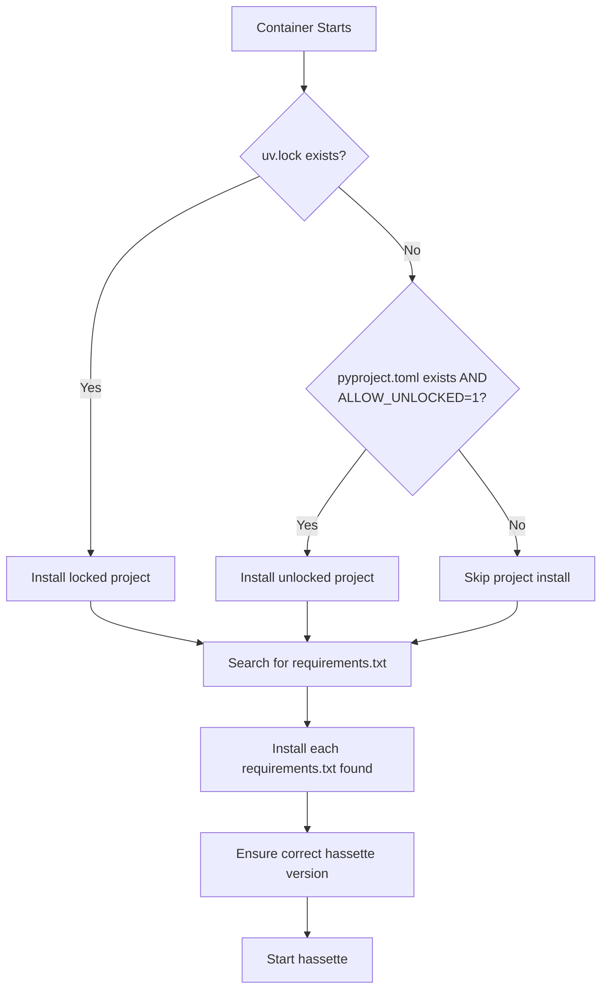

# Managing Dependencies

This guide explains how to install Python packages for your Hassette apps when running in Docker.

## Overview

Hassette's Docker startup script automatically discovers and installs dependencies before starting your apps. It supports two methods:

1. **Project-based** - Using `pyproject.toml` and `uv.lock` (recommended for complex projects)
2. **Requirements files** - Using `requirements.txt` files (simple approach)

## How the Startup Script Works

When the container starts, the [startup script](https://github.com/NodeJSmith/hassette/blob/main/scripts/docker_start.sh) performs these steps in order:



### Key Behaviors

1. **Project installation**: Looks for `uv.lock` or `pyproject.toml` in `HASSETTE__PROJECT_DIR` (defaults to `/apps`)
2. **Requirements discovery**: Uses `fd` to find all `requirements*.txt` files in both `/config` and `/apps` directories
3. **Version protection**: After installing your dependencies, reinstalls the correct hassette version to prevent conflicts

## Understanding APP_DIR vs PROJECT_DIR

These two environment variables serve different purposes:

| Variable                | Purpose                                                                               | Used By          |
| ----------------------- | ------------------------------------------------------------------------------------- | ---------------- |
| `HASSETTE__APP_DIR`     | Where Hassette looks for `.py` files containing `App`/`AppSync` classes               | Hassette runtime |
| `HASSETTE__PROJECT_DIR` | Where the startup script looks for `pyproject.toml`/`uv.lock` to install dependencies | Startup script   |

!!! important "Key Distinction"
    `APP_DIR` tells Hassette where your code lives. `PROJECT_DIR` tells the startup script where your package definition lives. These can be the same directory or different directories depending on your project structure.

## Project Structures

### Simple Flat Structure

For basic apps where you do not need to import sibling files, use a simple flat structure:

```
project_dir/
├── docker-compose.yml
├── config/
│   ├── hassette.toml
│   └── .env
└── apps/
    ├── my_app.py
    ├── another_app.py
    └── requirements.txt  # optional
```

**docker-compose.yml:**

```yaml
services:
  hassette:
    image: ghcr.io/nodejsmith/hassette:latest-py3.13
    volumes:
      - ./config:/config
      - ./apps:/apps
      - data:/data
      - uv_cache:/uv_cache
    # No need to set APP_DIR or PROJECT_DIR - defaults work fine
```

In this setup:

- `HASSETTE__APP_DIR` defaults to `/apps` ✓
- `HASSETTE__PROJECT_DIR` defaults to `/apps` ✓
- Any `requirements.txt` in `/apps` is automatically discovered and installed

### Traditional src/ Layout

For projects using the standard Python `src/` layout:

```
project_dir/
├── docker-compose.yml
├── config/
│   ├── hassette.toml
│   └── .env
├── pyproject.toml
├── uv.lock
└── src/
    └── my_apps/
        ├── __init__.py
        ├── app_one.py
        └── app_two.py
```

**docker-compose.yml:**

```yaml
services:
  hassette:
    image: ghcr.io/nodejsmith/hassette:latest-py3.13
    volumes:
      - ./config:/config
      - .:/apps  # Mount entire project to /apps
      - data:/data
      - uv_cache:/uv_cache
    environment:
      # Startup script finds pyproject.toml/uv.lock at /apps
      - HASSETTE__PROJECT_DIR=/apps
      # Hassette finds app files in /apps/src/my_apps
      - HASSETTE__APP_DIR=/apps/src/my_apps
```

In this setup:

- The project root (containing `pyproject.toml`) is mounted to `/apps`
- `HASSETTE__PROJECT_DIR=/apps` tells the startup script where to find dependencies
- `HASSETTE__APP_DIR=/apps/src/my_apps` tells Hassette where to find your app files
- Your App files can import from the `my_apps` package normally

## Using pyproject.toml

Create a `pyproject.toml` in your project:

```toml
[project]
name = "my-hassette-apps"
version = "0.1.0"
requires-python = ">=3.11"
dependencies = [
    "requests>=2.31.0",
    "aiohttp>=3.9.0",
    "pydantic>=2.0.0",
]
```

### With a Lock File (Recommended)

Generate a lock file for reproducible builds.

If a `uv.lock` file exists alongside your `pyproject.toml`, the startup script will automatically use it to pin exact versions.

!!! tip "No lock file tooling?"
  If you don't want to generate a lock file, you can use the simpler `requirements.txt` approach below.

### Without a Lock File

If you only have `pyproject.toml` without `uv.lock`, you must explicitly opt-in:

```yaml
environment:
  - HASSETTE__ALLOW_UNLOCKED_PROJECT=1
```

!!! warning "Reproducibility"
    Without a lock file, dependency versions may change between container restarts. Always use `uv.lock` for production deployments.

## Using requirements.txt

For simpler setups, place `requirements.txt` files anywhere in `/config` or `/apps`:

```
apps/
├── my_app.py
└── requirements.txt
```

**apps/requirements.txt:**

```
requests>=2.31.0
aiohttp>=3.9.0
```

The startup script uses `fd` to recursively find all files matching `requirements*.txt` in both `/config` and `/apps`, then installs them in sorted order.

### Multiple Requirements Files

You can have multiple requirements files:

```
apps/
├── requirements.txt
├── requirements-dev.txt
└── feature/
    └── requirements.txt
```

All files matching `requirements*.txt` will be discovered and installed.

!!! note "Installation Order"
    Files are installed in sorted order by path. Later files can override versions from earlier ones.

## Startup Performance

### Using uv.lock for Faster Starts

The `uv_cache` Docker volume caches downloaded packages. Combined with `uv.lock`, this makes subsequent container starts very fast:

```yaml
volumes:
  - uv_cache:/uv_cache  # Persist package cache
```

### Pre-building a Custom Image

For the fastest startup times, build a custom image with dependencies pre-installed:

```dockerfile
FROM ghcr.io/nodejsmith/hassette:latest-py3.13

# Copy your project files
COPY pyproject.toml uv.lock /apps/

# Install dependencies at build time
RUN uv sync --directory /apps --locked --active

# Your apps will be mounted at runtime
```

Then in `docker-compose.yml`:

```yaml
services:
  hassette:
    build: .
    volumes:
      - ./apps:/apps/src/my_apps  # Just mount app code
      - ./config:/config
```

## Troubleshooting Dependencies

### Dependencies Not Installing

1. **Check the logs** for installation output:

   ```bash
   docker compose logs hassette | grep -i "installing"
   ```

2. **Verify file locations** - make sure files are where the startup script expects:

   ```bash
   docker compose exec hassette ls -la /apps
   docker compose exec hassette cat /apps/pyproject.toml
   ```

3. **Check PROJECT_DIR** - ensure it points to the directory containing `pyproject.toml`:

   ```yaml
   environment:
     - HASSETTE__PROJECT_DIR=/apps  # Must contain pyproject.toml
   ```

### "Unlocked project" Not Installing

If you have `pyproject.toml` but no `uv.lock`, you must set:

```yaml
environment:
  - HASSETTE__ALLOW_UNLOCKED_PROJECT=1
```

### Version Conflicts

If you see version conflicts:

1. Pin exact versions in your dependencies
2. Use `uv.lock` to ensure consistent resolution
3. Check if your dependencies conflict with hassette's requirements

### Import Errors at Runtime

If apps fail to import installed packages:

1. Verify the package is listed in dependencies
2. Check logs for installation errors
3. Ensure `HASSETTE__APP_DIR` points to the correct location

## Complete Examples

### Example 1: Simple Flat Structure

```yaml
# docker-compose.yml
services:
  hassette:
    image: ghcr.io/nodejsmith/hassette:latest-py3.13
    volumes:
      - ./config:/config
      - ./apps:/apps
      - data:/data
      - uv_cache:/uv_cache
    environment:
      - TZ=America/New_York

volumes:
  data:
  uv_cache:
```

```
# apps/requirements.txt
requests>=2.31.0
```

### Example 2: src/ Layout with Lock File

```yaml
# docker-compose.yml
services:
  hassette:
    image: ghcr.io/nodejsmith/hassette:latest-py3.13
    volumes:
      - ./config:/config
      - .:/apps
      - data:/data
      - uv_cache:/uv_cache
    environment:
      - HASSETTE__PROJECT_DIR=/apps
      - HASSETTE__APP_DIR=/apps/src/my_apps
      - TZ=America/New_York

volumes:
  data:
  uv_cache:
```

```toml
# pyproject.toml
[project]
name = "my-hassette-apps"
version = "0.1.0"
requires-python = ">=3.11"
dependencies = [
    "requests>=2.31.0",
    "aiohttp>=3.9.0",
]
```

## See Also

- [Docker Overview](index.md) - Quick start guide
- [Troubleshooting](troubleshooting.md) - Common issues and solutions
