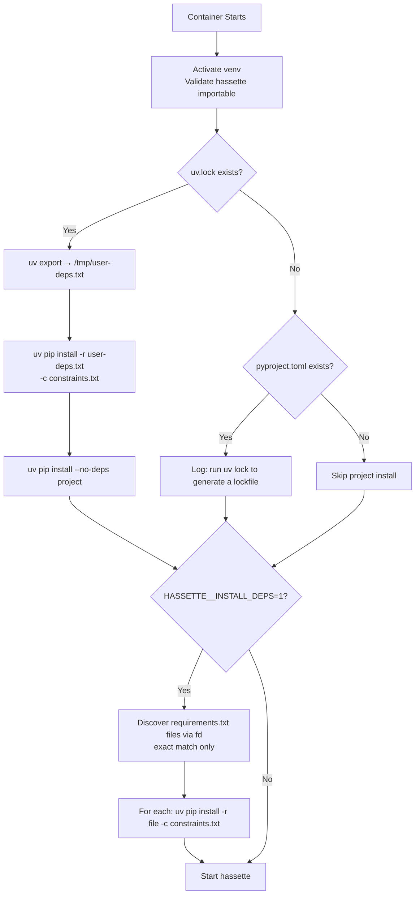

# Managing Dependencies

This guide explains how to install Python packages for your Hassette apps when running in Docker.

## Overview

Hassette's Docker startup script installs project dependencies automatically and optionally discovers `requirements.txt` files when enabled. It supports two methods:

1. **Project-based** — using `pyproject.toml` and `uv.lock` (recommended for complex projects)
2. **Requirements files** — using `requirements.txt` (simple approach, opt-in)

### How Constraints Work

Hassette's Docker image includes a constraints file (`/app/constraints.txt`) that records the compatible version ranges for all framework dependencies. When you install your own packages, the startup script passes this file to `uv`, so any dependency that would conflict with hassette's requirements causes a clear error message rather than a silent downgrade. If you see a conflict error, it usually means your `uv.lock` was generated against a different hassette version than the image — running `uv lock` locally and committing the result fixes it. See [Dependency Conflicts](troubleshooting.md#dependency-conflicts) for details.

## How the Startup Script Works

When the container starts, the [startup script](https://github.com/NodeJSmith/hassette/blob/main/scripts/docker_start.sh) performs these steps in order:


```mermaid
graph TD
    A[Container Starts] --> B[Activate venv\nValidate hassette importable]
    B --> C{uv.lock exists?}
    C -->|Yes| D[uv export → /tmp/user-deps.txt]
    D --> E[uv pip install -r user-deps.txt\n-c constraints.txt]
    E --> F[uv pip install --no-deps project]
    C -->|No| G{pyproject.toml exists?}
    G -->|Yes| H[Log: run uv lock to generate a lockfile]
    G -->|No| I[Skip project install]
    F --> J{HASSETTE__INSTALL_DEPS=1?}
    H --> J
    I --> J
    J -->|Yes| K[Discover requirements.txt files via fd\nexact match only]
    K --> L[For each: uv pip install -r file -c constraints.txt]
    L --> M[Start hassette]
    J -->|No| M
```

### Key Behaviors

1. **Export-then-install**: When a `uv.lock` is found, the startup script exports your resolved dependencies to a temporary requirements file and installs them through the constraints file. This routes all dependency resolution through a single enforcement point rather than bypassing constraints.
2. **Opt-in requirements discovery**: `requirements.txt` files are only discovered when `HASSETTE__INSTALL_DEPS=1` is set. By default, no requirements files are scanned.
3. **Exact filename match**: Only files named exactly `requirements.txt` are discovered — not `requirements-dev.txt`, `requirements_test.txt`, or other variants. This prevents dev and test dependencies from being silently installed in the production container.
4. **Constraints protection for all installs**: Every `uv pip install` — whether from a project lockfile or a `requirements.txt` — passes `-c /app/constraints.txt`. Conflicts produce a clear error message before the container exits.
5. **Fail-fast**: A failing dependency install exits the container immediately with an actionable message. With `restart: unless-stopped`, Docker retries automatically, giving transient network issues a chance to resolve.
6. **Timeouts**: All network calls are wrapped with `timeout` (300 s for project export/install, 120 s per requirements file).

## Understanding APP_DIR vs PROJECT_DIR

These two environment variables serve different purposes:

| Variable                | Purpose                                                                               | Used By          |
| ----------------------- | ------------------------------------------------------------------------------------- | ---------------- |
| `HASSETTE__APP_DIR`     | Where Hassette looks for `.py` files containing `App`/`AppSync` classes               | Hassette runtime |
| `HASSETTE__PROJECT_DIR` | Where the startup script looks for `pyproject.toml`/`uv.lock` to install dependencies | Startup script   |

!!! important "Key Distinction"
    `APP_DIR` tells Hassette where your code lives. `PROJECT_DIR` tells the startup script where your package definition lives. These can be the same directory or different directories depending on your project structure.

## Project Structures

### Simple Flat Structure

For basic apps where you do not need to import sibling files, use a simple flat structure:

```
project_dir/
├── docker-compose.yml
├── config/
│   ├── hassette.toml
│   └── .env
└── apps/
    ├── my_app.py
    ├── another_app.py
    └── requirements.txt  # optional
```

**docker-compose.yml:**

```yaml
services:
  hassette:
    image: ghcr.io/nodejsmith/hassette:latest-py3.13
    volumes:
      - ./config:/config
      - ./apps:/apps
      - data:/data
      - uv_cache:/uv_cache
    # No need to set APP_DIR or PROJECT_DIR - defaults work fine
```

In this setup:

- `HASSETTE__APP_DIR` defaults to `/apps` ✓
- `HASSETTE__PROJECT_DIR` defaults to `/apps` ✓

!!! note "Opt-in required for requirements.txt"
    A `requirements.txt` in `/apps` is **not** installed automatically. You must set `HASSETTE__INSTALL_DEPS=1` for the startup script to discover and install it. See [Using requirements.txt](#using-requirementstxt) below.

### Traditional src/ Layout

For projects using the standard Python `src/` layout:

```
project_dir/
├── docker-compose.yml
├── config/
│   ├── hassette.toml
│   └── .env
├── pyproject.toml
├── uv.lock
└── src/
    └── my_apps/
        ├── __init__.py
        ├── app_one.py
        └── app_two.py
```

**docker-compose.yml:**

```yaml
services:
  hassette:
    image: ghcr.io/nodejsmith/hassette:latest-py3.13
    volumes:
      - ./config:/config
      - .:/apps  # Mount entire project to /apps
      - data:/data
      - uv_cache:/uv_cache
    environment:
      # Startup script finds pyproject.toml/uv.lock at /apps
      - HASSETTE__PROJECT_DIR=/apps
      # Hassette finds app files in /apps/src/my_apps
      - HASSETTE__APP_DIR=/apps/src/my_apps
```

In this setup:

- The project root (containing `pyproject.toml`) is mounted to `/apps`
- `HASSETTE__PROJECT_DIR=/apps` tells the startup script where to find dependencies
- `HASSETTE__APP_DIR=/apps/src/my_apps` tells Hassette where to find your app files
- Your app files can import from the `my_apps` package normally

## Using pyproject.toml

Create a `pyproject.toml` in your project:

```toml
[project]
name = "my-hassette-apps"
version = "0.1.0"
requires-python = ">=3.11"
dependencies = [
    "requests>=2.31.0",
    "aiohttp>=3.9.0",
    "pydantic>=2.0.0",
]
```

### With a Lock File (Required)

Generate a lock file before deploying:

```bash
uv lock
git add uv.lock
git commit -m "add uv.lock"
```

If a `uv.lock` file exists alongside your `pyproject.toml`, the startup script uses the export-then-install pattern: it exports your resolved dependencies as a flat requirements list and installs them through the constraints file.

!!! note "Lock file is required for project-based installs"
    If your `pyproject.toml` is present but no `uv.lock` exists, the startup script logs a message directing you to run `uv lock` and skips the project install. If you can't run `uv` locally, use the `requirements.txt` path with `HASSETTE__INSTALL_DEPS=1` instead.

## Using requirements.txt

For simpler setups, place a `requirements.txt` file in `/config` or `/apps`:

```
apps/
├── my_app.py
└── requirements.txt
```

**apps/requirements.txt:**

```
requests>=2.31.0
aiohttp>=3.9.0
```

!!! warning "Opt-in required"
    Requirements file discovery is disabled by default. Set `HASSETTE__INSTALL_DEPS=1` in your compose environment to enable it.

```yaml
environment:
  - HASSETTE__INSTALL_DEPS=1
```

The startup script uses `fd` to find files named exactly `requirements.txt` in both `/config` and `/apps` (up to 5 directory levels deep), then installs them in sorted path order with constraints applied.

!!! note "Exact filename match only"
    Only files named exactly `requirements.txt` are discovered. Files named `requirements-dev.txt`, `requirements_test.txt`, or any other variant are ignored. If you need multiple files, use the project-based install with `pyproject.toml` + `uv.lock`.

## Startup Performance

### Using uv.lock for Faster Starts

The `uv_cache` Docker volume caches downloaded packages. Combined with `uv.lock`, this makes subsequent container starts very fast because packages that are already cached don't need to be re-downloaded:

```yaml
volumes:
  - uv_cache:/uv_cache  # Persist package cache
```

### Pre-building a Custom Image

For the fastest startup times, build a custom image with your dependencies pre-installed. Use the export-then-install pattern to ensure constraints are respected:

```dockerfile
FROM ghcr.io/nodejsmith/hassette:latest-py3.13

# Copy your project files
COPY pyproject.toml uv.lock /project/

# Export resolved deps as a flat requirements list
RUN uv export \
        --no-hashes --frozen \
        --directory /project \
        --no-default-groups \
        --no-dev --no-editable --no-emit-project \
        --output-file /tmp/user-deps.txt

# Install through constraints
RUN uv pip install -r /tmp/user-deps.txt -c /app/constraints.txt

# Install the project package itself (no dep resolution)
RUN uv pip install --no-deps /project

RUN rm /tmp/user-deps.txt
```

Then in `docker-compose.yml`:

```yaml
services:
  hassette:
    build: .
    volumes:
      - ./apps:/apps/src/my_apps  # Just mount app code
      - ./config:/config
```

### Known Limitations

#### Local Path Dependencies

User projects with local path dependencies (e.g., `foo = { path = "../shared-lib" }`) will fail during the export step because `uv export` emits `file:///absolute/path` references that don't resolve inside the container. If your project uses monorepo-style local deps, use the custom image build pattern above — copy all relevant packages into the image at build time and install them before deploying.

## Complete Examples

### Example 1: Simple Flat Structure

```yaml
# docker-compose.yml
services:
  hassette:
    image: ghcr.io/nodejsmith/hassette:latest-py3.13
    volumes:
      - ./config:/config
      - ./apps:/apps
      - data:/data
      - uv_cache:/uv_cache
    environment:
      - TZ=America/New_York
      - HASSETTE__INSTALL_DEPS=1

volumes:
  data:
  uv_cache:
```

```
# apps/requirements.txt
requests>=2.31.0
```

### Example 2: src/ Layout with Lock File

```yaml
# docker-compose.yml
services:
  hassette:
    image: ghcr.io/nodejsmith/hassette:latest-py3.13
    volumes:
      - ./config:/config
      - .:/apps
      - data:/data
      - uv_cache:/uv_cache
    environment:
      - HASSETTE__PROJECT_DIR=/apps
      - HASSETTE__APP_DIR=/apps/src/my_apps
      - TZ=America/New_York

volumes:
  data:
  uv_cache:
```

```toml
# pyproject.toml
[project]
name = "my-hassette-apps"
version = "0.1.0"
requires-python = ">=3.11"
dependencies = [
    "requests>=2.31.0",
    "aiohttp>=3.9.0",
]
```

## See Also

- [Docker Overview](index.md) - Quick start guide
- [Troubleshooting](troubleshooting.md) - Common issues and solutions
