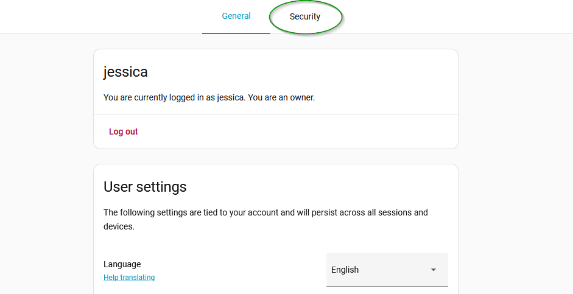
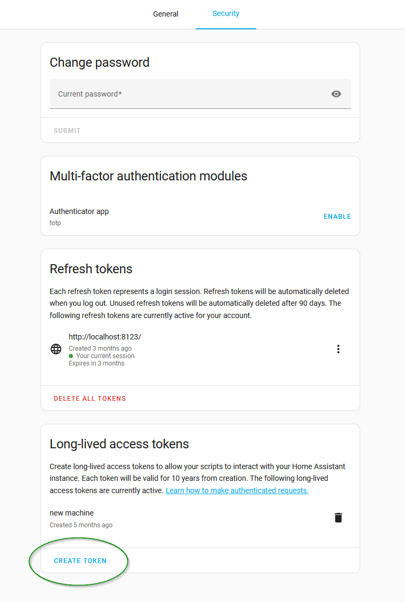
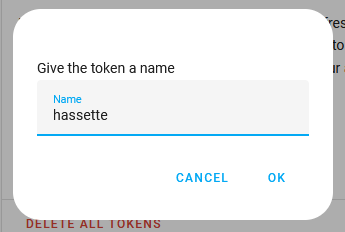
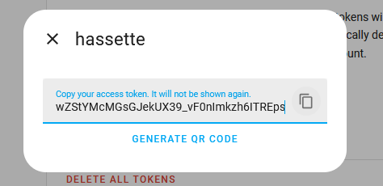

# Creating a Home Assistant token

 To interact with Home Assistant, Hassette needs a long-lived access token. Follow these steps to create one:

#### Go to the [Profile](https://my.home-assistant.io/redirect/profile/) page in your Home Assistant instance and click the "Security" tab.

   

#### Scroll down to the "Long-Lived Access Tokens" section and click "Create Token".

   

#### Enter a name for the token (e.g., "Hassette") and click "OK".

   

#### Copy the generated token and store it securely. You won't be able to see it again!

   

#### Save the token somewhere safe, such as in a password manager, as you'll need it to configure Hassette.
