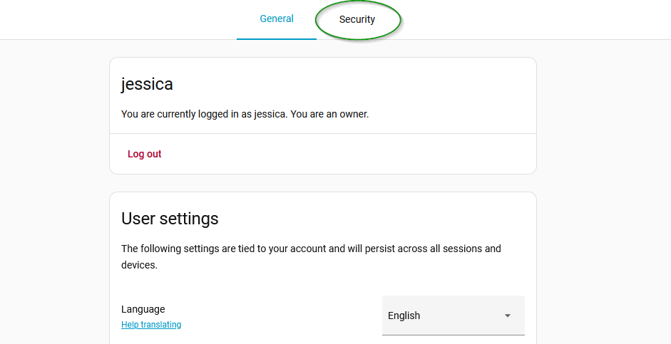
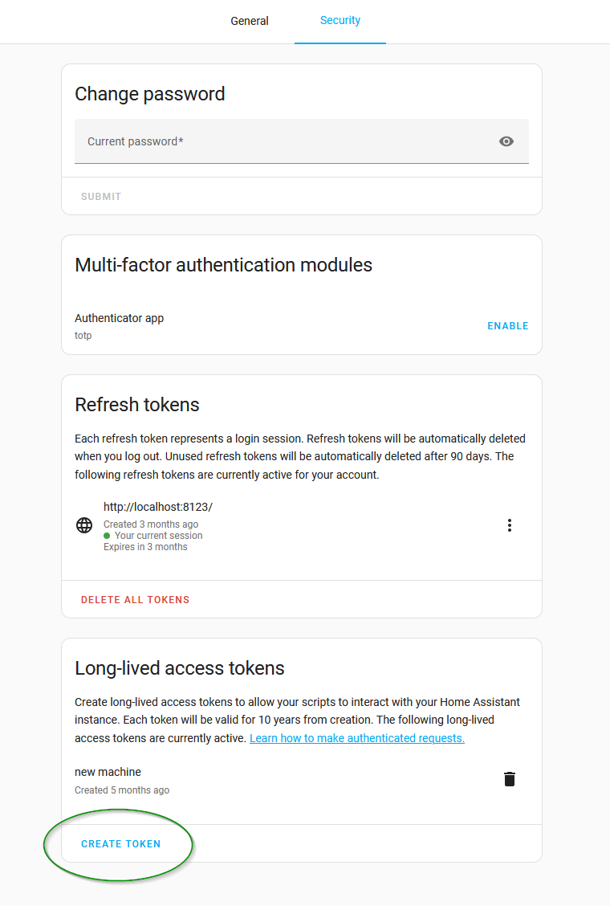
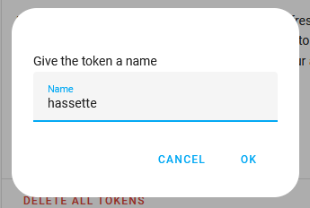
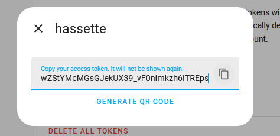

# Creating a Home Assistant Token

Hassette connects to Home Assistant over the WebSocket API. To authenticate, it needs a **long-lived access token** — a static credential that you generate once and store in your `.env` file as `HASSETTE__TOKEN`.

Long-lived access tokens belong to your Home Assistant user account and grant the same permissions as that account. Create a dedicated token for Hassette so you can revoke it independently if needed.

## Steps

#### Go to the [Profile](https://my.home-assistant.io/redirect/profile/) page in your Home Assistant instance and click the "Security" tab.

   

#### Scroll down to the "Long-Lived Access Tokens" section and click "Create Token".

   

#### Enter a name for the token (e.g., "Hassette") and click "OK".

   

#### Copy the generated token and store it securely. You won't be able to see it again!

   

#### Save the token somewhere safe, such as in a password manager, as you'll need it to configure Hassette.

## What to do with the token

Once you have the token, add it to `config/.env`:

```
HASSETTE__TOKEN=your_long_lived_access_token_here
```

See the [Local Setup](index.md) guide for the full configuration steps.

!!! warning "Keep your token secret"
    The token has the same permissions as your Home Assistant user account. Never commit it to version control or share it publicly. If a token is exposed, revoke it immediately from the same Security tab and generate a new one.
