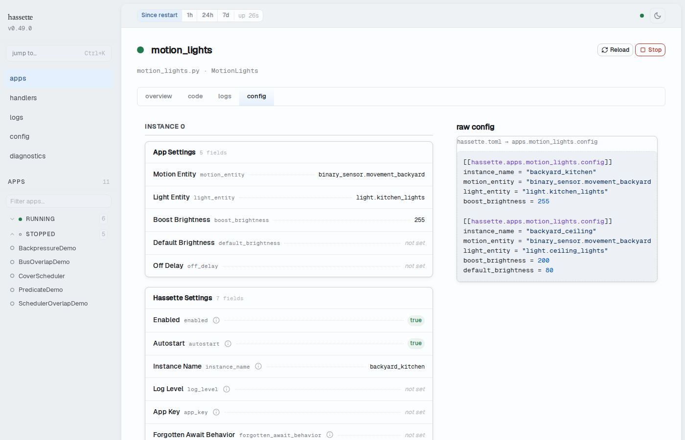

# Config Tab

The Config tab shows the configuration loaded for this app: file path, class name, enabled
state, and the full set of config field values with their types. Use it to verify that the
right configuration was loaded, check which values are set versus defaulted, and inspect
the parsed config values as JSON.



## Metadata header

The header shows three fields sourced from the app's registration:

| Field | Description |
|-------|-------------|
| **File** | Path to the source file containing this app class (monospaced) |
| **Class** | Python class name of the app (monospaced) |
| **Enabled** | `yes` (green) if the app is enabled, `no` if disabled |

## Configuration table

The main panel shows a typed table of all configuration fields declared on the app's
`AppConfig` class. Column types are derived from the class schema:

| Column | Description |
|--------|-------------|
| **Key** | The config field name as defined on the `AppConfig` class |
| **Type** | Python type — `string`, `number`, `boolean`, or a union like `string \| null` |
| **Value** | The loaded value. `—` is shown when the value is `None` or not set. |

Fields defined in the `AppConfig` schema are shown first, followed by any extra keys present
in the loaded config that don't appear in the schema.

### Complex values

Object and array values show a summary (`{N keys}` or `[N items]`). Click the summary to
expand the full JSON inline below the row.

### Apps with no custom config

If the app uses the base `AppConfig` without any custom fields, the table shows "no
configuration fields — this app uses the default AppConfig with no custom fields."

## Raw config panel

Below the configuration table, the **raw config** section shows the JSON representation of
the config values exactly as loaded at startup. The header shows where these values
originated in `hassette.toml`:

```
hassette.toml → apps.<app_key>.config
```

This is useful for verifying environment variable overrides, confirming that nested config
values were parsed correctly, or copying a value to use in a test fixture.

## Multi-instance apps

Apps with multiple instances configured in `hassette.toml` show each instance in its own
block with an **Instance N** heading (starting at `Instance 0`). Each block has its own
typed configuration table showing the values for that instance.

The raw config panel below shows the full array of instance configs.

!!! tip
    To navigate between instances, use the instance switcher at the top of the App Detail
    page. The Config tab updates to show the selected instance's values.

## Related pages

- [App Detail](index.md) — breadcrumb, instance switcher, and tab strip
