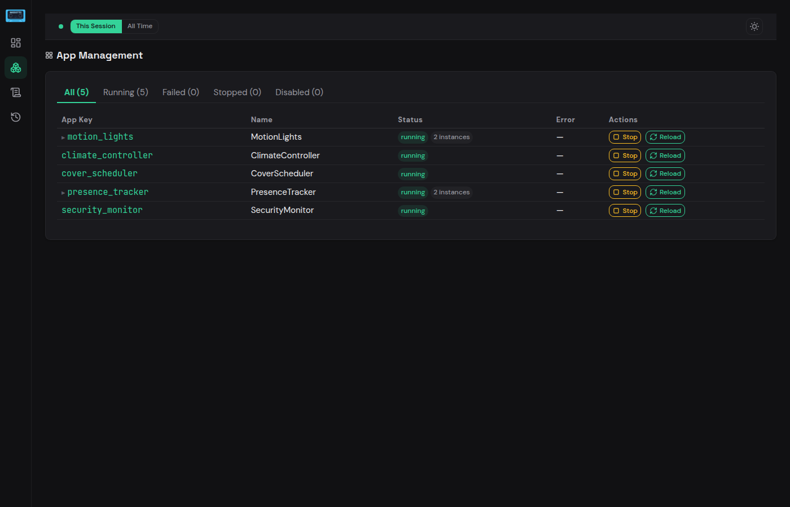

# Apps

The Apps page lets you view and manage all registered automations.

## Status Summary

A badge at the top shows the current count by status (e.g. "7 running"). Below it, filter tabs let you narrow the list:

- **All** — every registered app
- **Running** — actively running apps
- **Stopped** — manually stopped apps
- **Failed** — apps that encountered an error
- **Disabled** — apps disabled in configuration

Each tab shows its count, so you can spot problems at a glance.

## App Table

The table displays one row per app with the following columns:

| Column | Description |
|--------|-------------|
| **App Key** | Unique identifier (links to the app detail view) |
| **Name** | Display name of the app |
| **Class** | Python class name |
| **Status** | Current status badge (running, stopped, failed, disabled) |
| **Error** | Error message if the app has failed, otherwise `—` |
| **Actions** | Stop and Reload buttons |

## Actions

Each app row has action buttons:

- **Stop** (red) — stops the app.
- **Reload** (blue) — reloads the app, picking up code changes.
- **Start** — appears when an app is stopped or failed.

!!! note
    App actions require `dev_mode` to be enabled, or `allow_reload_in_prod` set to `true`. See [Global Settings](../core-concepts/configuration/global.md) for details.

## Multi-Instance Apps

Apps configured with multiple instances show an expandable row. Click the chevron to reveal individual instances. In the screenshot above, `new_remote_app` is a `RemoteApp` with two instances: `jessica_remote` and `other_remote`. Each instance has its own status and action buttons.

## App Detail View

Clicking an app key navigates to a detail page that shows:

- App metadata (class, status, configuration)
- **Listeners** — event bus subscriptions for that app
- **Jobs** — scheduled jobs belonging to the app
- **Logs** — log entries filtered to that app

This gives you a focused view of everything related to a single automation.
