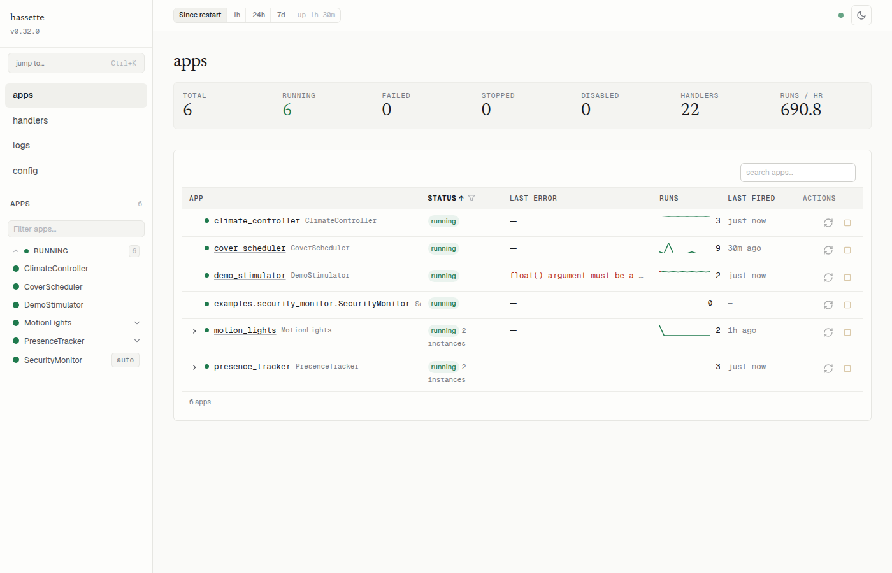

# Apps

The Apps page lets you view and manage all registered automations.

## Status Filter

Filter tabs at the top let you narrow the app list by status:

- **All** — every registered app
- **Running** — actively running apps
- **Failed** — apps that encountered an error
- **Stopped** — manually stopped apps
- **Disabled** — apps disabled in configuration

Each tab shows its count so you can spot problems at a glance.

## App Table

The table displays one row per app with the following columns:

| Column | Description |
|--------|-------------|
| **App Key** | Unique identifier (links to the app detail view) |
| **Name** | Display name of the app. If the class name differs from the display name, the class name appears below it. |
| **Status** | Current status badge: running, stopped, failed, disabled, or blocked (waiting for a dependency to become ready — typically resolves automatically) |
| **Error** | Error message if the app has failed, otherwise `—` |
| **Actions** | Stop, Reload, and Start buttons |

On mobile, the table switches to a card layout with the same information.

## Actions

Each app row has action buttons that depend on the app's current status:

- **Stop** — stops a running app.
- **Reload** — reloads a running app, picking up code changes.
- **Start** — appears when an app is stopped or failed; restarts it.

## Multi-Instance Apps

Apps configured with multiple instances show an expandable row. Click the chevron next to the app key to reveal individual instances. Each instance has its own status badge and action buttons.

## App Detail View

Clicking an app key navigates to a detail page that shows:

- **Event Handlers** — event bus subscriptions for that app, with listener counts
- **Scheduled Jobs** — active scheduled jobs belonging to the app
- **Logs** — log entries filtered to that app

Multi-instance apps include an instance selector at the top. The active instance's health data, listeners, and jobs are scoped to the selected instance.
