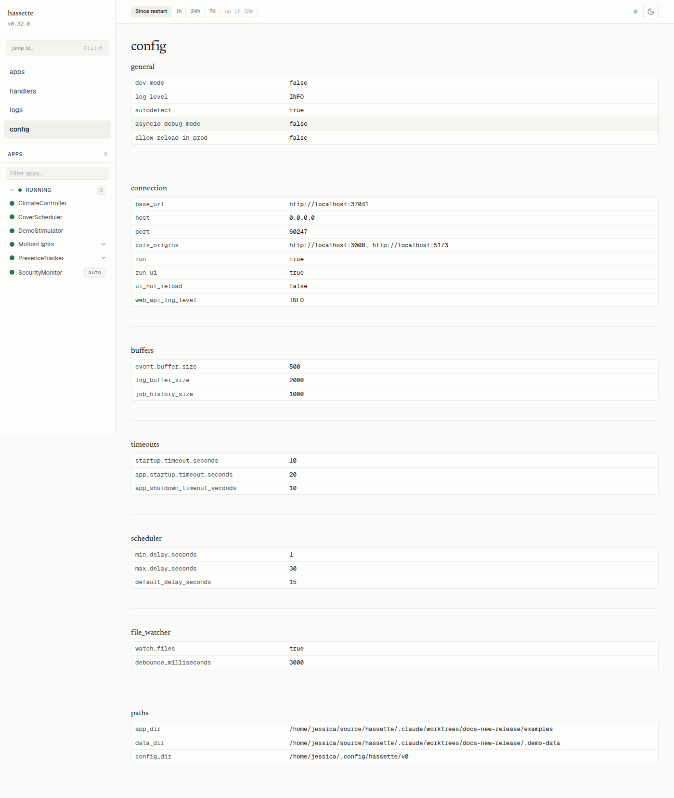

# Config

The Config page shows the active Hassette configuration as a read-only view.
Use it to confirm what settings the running instance loaded — useful when
verifying that a config file change took effect after a reload.

## Configuration groups

Settings are organized into seven groups, each displayed as a card with a
key-value table. Keys are shown as displayed in the UI — see
[Global Settings](../core-concepts/configuration/global.md) for the
corresponding `hassette.toml` setting names.

Values reflect the configuration as loaded at the most recent startup or
reload. The page does not stream live updates — refresh your browser after
a Hassette reload to see updated values.

- **general** — `dev_mode`, `log_level`, `autodetect`, `asyncio_debug_mode`,
  `allow_reload_in_prod`
- **connection** — `base_url`, `host`, `port`, `cors_origins`, `run`, `run_ui`,
  `ui_hot_reload`, `web_api_log_level`
- **buffers** — `event_buffer_size`, `log_buffer_size`, `job_history_size`
- **timeouts** — `startup_timeout_seconds`, `app_startup_timeout_seconds`,
  `app_shutdown_timeout_seconds`
- **scheduler** — `min_delay_seconds`, `max_delay_seconds`,
  `default_delay_seconds`
- **file_watcher** — `watch_files`, `debounce_milliseconds`
- **paths** — `app_dir`, `data_dir`, `config_dir`

## Value formatting

Values are rendered as follows:

- **Booleans** — `true` or `false`
- **Numbers** — plain numeric value
- **Arrays** — comma-separated list
- **Null or empty** — `—`

## Related pages

- [Configuration](../core-concepts/configuration/global.md) — reference for
  all available settings and how to change them
- [Web UI Overview](index.md) — enabling, accessing, and configuring the web UI
