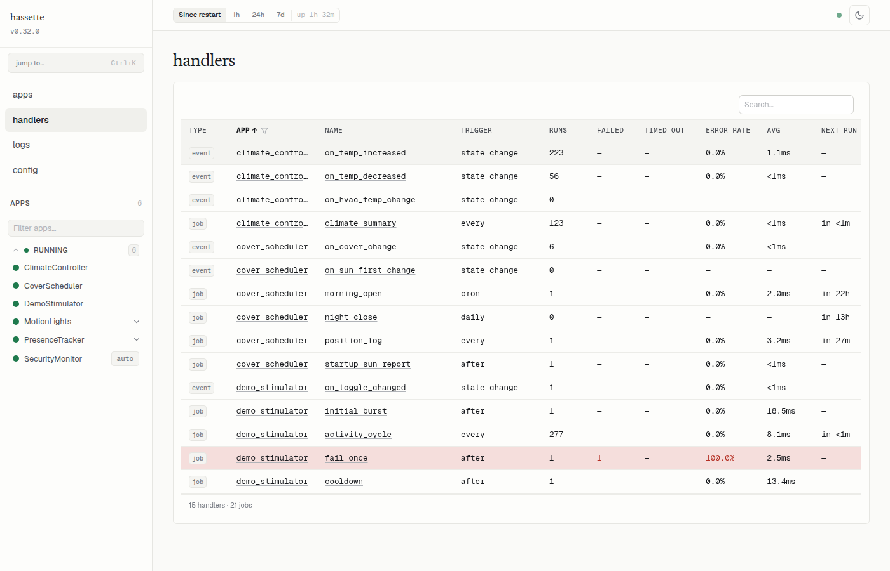
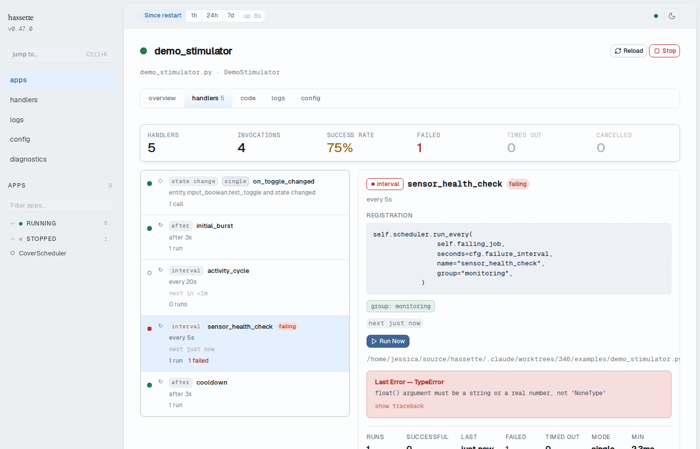
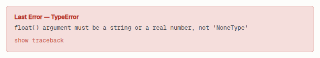

# Debug a Failing Handler

Three things go wrong with handlers: they don't fire, they fire but error, or they fire too often. The web UI shows which is happening and why.

## Quick Diagnosis

| Symptom | Check | What to look for |
|---|---|---|
| Handler never fires | Handlers page (sidebar > Handlers) | Missing from list, or zero invocations |
| Handler fires but errors | App detail > Handlers tab | Error count > 0, error details |
| Handler fires too often | App detail > Handlers tab | High invocation count, check predicate or debounce |

## Common Causes

**Missing `name=` on subscription.** `Bus` registration raises [`ListenerNameRequiredError`][hassette.exceptions.ListenerNameRequiredError] at call time if `name=` is omitted. The handler never appears in the Handlers page. Add `name="descriptive_name"` to the `bus.on_state_change()` call. See [handler registration](../core-concepts/bus/handlers.md) for the full signature.

**Wrong entity pattern.** The handler is registered for `"light.kitchen"` but the entity is `"light.kitchen_ceiling"`. The handler exists in the Handlers page but shows zero invocations. Check the listener's trigger column for the exact pattern that was registered, then correct it in the source.

**`changed_to` type mismatch.** Home Assistant state values are strings. `changed_to=True` never matches because the value on the wire is `"on"`, not `True`. Use `changed_to="on"` and `changed_to="off"`.

**DI annotation mismatch.** A handler annotated with the wrong state type raises [`DependencyResolutionError`][hassette.exceptions.DependencyResolutionError] at invocation time. The error banner in the handler detail panel shows the exception class and message. Check the parameter annotation against the entity's domain and see [dependency injection](../core-concepts/bus/dependency-injection.md) for the available types.

**Domain excluded.** If the entity's domain appears in `bus_excluded_domains`, Hassette drops all events for that domain before they reach any handler. The handler exists and registers cleanly, but invocations never arrive. Check `bus_excluded_domains` in your `hassette.toml` and remove the domain if the exclusion is unintentional.

## Using the Handlers Page

Open **Handlers** in the sidebar. The page shows every registered event handler and scheduled job across all your apps in one table.

Find your handler by searching the name box or filtering by app with the **App** column dropdown. The table shows:

- **Runs**: total invocations in the current time window. Zero means the handler has never fired, or the time window is too narrow.
- **Failed**: count of invocations that raised an unhandled exception. Shown in red when non-zero.
- **Error rate**: failed divided by runs, as a percentage.

Rows with any failure are highlighted in red. Click the handler name to go straight to the handler detail in the app's Handlers tab.

The time window for all counts comes from the preset selector in the status bar. If you see zero runs for a handler you expect to have fired, widen the window to **Since restart**. A narrow window hides older invocations.

## Drilling into Handler History

Open the app from the sidebar, then select the **Handlers** tab. The left panel lists every handler and job for this app. The right panel shows detail for the selected item.

Select your handler. The detail panel shows:

- **Registration source**: the exact `bus.on_state_change()` call Hassette recorded at startup, including the entity pattern and any options.
- **Modifier chips**: any behavioral options in effect: `debounce`, `throttle`, `once`, `priority`, `immediate`, or `duration`. A handler with no modifiers shows no chip row.
- **Source location**: the file path and line number where the handler is defined. Click **view in code →** to open the Code tab at that line.
- **Error banner**: appears when the handler has at least one failure. Shows the exception class, the full message, and a **show traceback** toggle that expands the Python traceback inline.

- **Stats grid**: calls, successful, failed, timed out, and min/avg/max duration for the current time window.
- **Invocations table**: the 50 most recent invocations, each with a status indicator, timestamp, duration, and execution ID. The table updates in real time.

A gray ring on a handler in the left panel means it has never been invoked. A red square means at least one invocation has failed or timed out.

Select a scheduled job instead of a handler and the detail panel adds a **Run Now** button. Clicking it triggers the job immediately, outside its normal schedule. The button shows a spinner while the request is in flight and stays disabled until it completes, so double clicks can't fire two executions. A 409 response — the job is already running in single mode, or has already fired as a one-shot — shows an inline error below the button.

The execution history updates with the new run over the WebSocket connection, no refresh needed. A manually triggered row carries a **manual** badge next to its status, so you can tell it apart from a scheduled fire at a glance.

## Tracing a Single Execution

Click an execution ID in the invocations table. Hassette opens the [Logs page](logs.md) filtered to that execution with `?execution_id=<id>` in the URL. Every log line the handler emitted during that run appears together, in order.

You can also construct the URL manually. Grab the execution ID from a CLI command or another log entry.

## Related Pages

- [Web UI overview](index.md): navigation, layout, and status bar controls
- [Manage Apps](manage-apps.md): app health, start/stop/reload, and status badges
- [Logs](logs.md): full log view with execution ID filtering
- [`Bus` handlers](../core-concepts/bus/handlers.md): handler registration, `name=` requirement, and options
- [Dependency injection](../core-concepts/bus/dependency-injection.md): DI annotation reference
