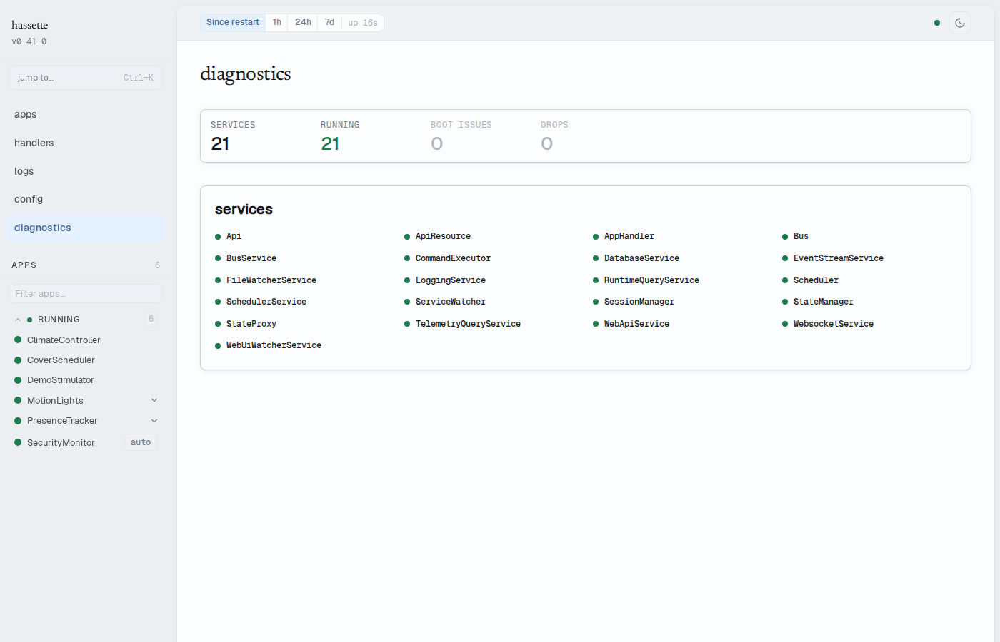

# Diagnostics

The Diagnostics page answers one question: is the framework itself healthy? It covers
Hassette's internal services, startup issues, and telemetry pipeline health — the layer
below your apps.

## Stats strip

The strip at the top summarizes the page in four numbers:

| Cell | Meaning |
|------|---------|
| services | Total internal services registered |
| running | Services currently in the `running` state — green when all are running, amber otherwise |
| boot issues | Problems detected during startup — red when non-zero |
| drops | Telemetry records dropped across all categories — amber when non-zero |

## Services

The services panel lists every internal service (Bus, Scheduler, Api, DatabaseService,
and the rest) as a compact grid. A healthy service shows only its name and a green dot —
status text appears when there is something to say.

Services that are not running sort to the top and span the full row, showing their status,
readiness phase, and — for a service in cooldown after repeated failures — when the
supervisor will retry. A failed service with a captured exception gets a "show exception"
toggle that expands the full traceback inline.

Service states update live over the WebSocket connection. When the connection drops, a
`stale` badge appears next to the panel heading and the data reflects the last known state.

## Boot issues

The boot issues panel appears only when startup produced warnings or errors — a missing
app directory, an app that failed to import, a config problem. Issues sort errors-first,
each with a label and detail text. A clean startup renders no panel; the stats strip's
zero is the confirmation.

## Telemetry health

The telemetry panel appears when the telemetry pipeline is degraded or has dropped
records. Drop counters are broken out by cause: buffer overflow, failed writes, drops
during shutdown, and error-handler failures. A degraded banner means writes may be
failing or the database is unavailable — some historical data may be missing.

## Related pages

- [Layout & Navigation](layout.md) — sidebar, status bar, and command palette
- [Health Endpoints](health-endpoints.md) — the REST endpoints behind this page
