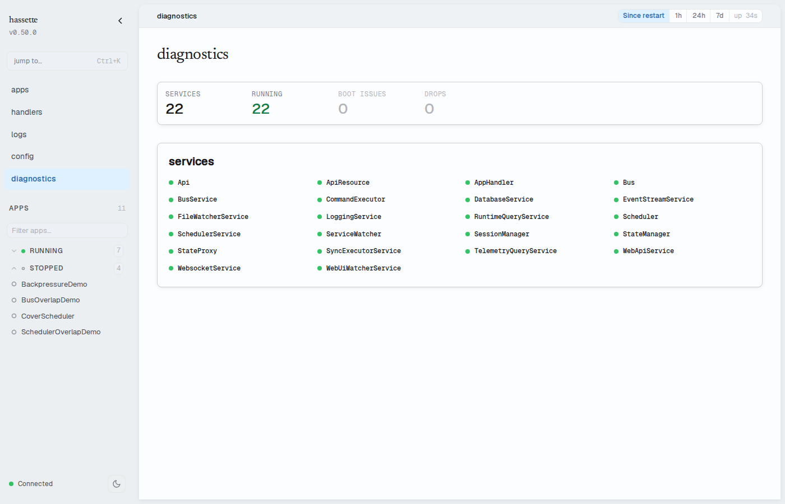

# Check Framework Health

The Diagnostics page (sidebar > diagnostics) answers one question: is the framework
itself healthy? It covers Hassette's internal services, startup issues, and telemetry
pipeline health — the layer below your apps.

## Stats strip

The strip at the top summarizes the page:

| Cell | Meaning |
|------|---------|
| services | Total internal services registered |
| running | Services currently in the `running` state — green when all are running, amber otherwise |
| boot issues | Problems detected during startup — red when non-zero |
| telemetry drops | Telemetry records dropped across all causes — amber when non-zero |
| log queue drops | Log records dropped because the log queue was full — amber when non-zero |
| DB write drops | Log records not persisted because the database write queue was full or unavailable — amber when non-zero |
| loop stalls | Event-loop stalls not credited to any app, in the selected time window — amber when non-zero. See [Loop stalls](#loop-stalls) |

## Services

The services panel lists every internal service (Bus, Scheduler, Api, DatabaseService,
and the rest) as a compact grid. A healthy service shows only its name and a green dot —
status text appears when there is something to say.

Services that are not running sort to the top and span the full row, showing their status,
readiness phase, and — for a service in cooldown after repeated failures — when the
supervisor will retry. A failed service with a captured exception gets a "show exception"
toggle that expands the full traceback inline.

Service states update live over the WebSocket connection. When the connection drops, a
`stale` badge appears next to the panel heading and the data reflects the last known state.

## Boot issues

The boot issues panel appears only when startup produced warnings or errors — a missing
app directory, an app that failed to import, a config problem. Issues sort errors-first,
each with a label and detail text. A clean startup renders no panel; the stats strip's
zero is the confirmation.

## Telemetry health

The telemetry panel appears when the telemetry pipeline is degraded or has dropped
records. Drop counters are broken out by cause: buffer overflow, failed writes, drops
during shutdown, and error-handler failures. A degraded banner means writes may be
failing or the database is unavailable — some historical data may be missing.

## Loop stalls

The loop stalls panel appears when [blocking-IO detection](../core-concepts/blocking-io-detection.md) recorded stalls in the selected time window that it couldn't credit to an app. Hassette blames an app only when that app's code was the task holding the loop, so these stalls fall into two groups:

- **displaced**: an app execution was in flight, but a different task held the loop, so Hassette withheld the blame rather than guess.
- **framework**: no app execution was responsible, for example a library callback or Hassette's own work.

The panel shows the count of each and the longest stall, then lists the most recent stalls with their duration and a **show stack** toggle. When a stall's stack contains app code, the row names that line as a lead to investigate. The stall still isn't credited to that app, because a helper in one app's directory can be called by several apps.

Stalls that Hassette did credit to an app appear on that app's overview instead.

## Related pages

- [Web UI Overview](index.md) — layout, navigation, and alert banners
- [Configure Health Checks](health-endpoints.md) — the REST endpoints behind this page
