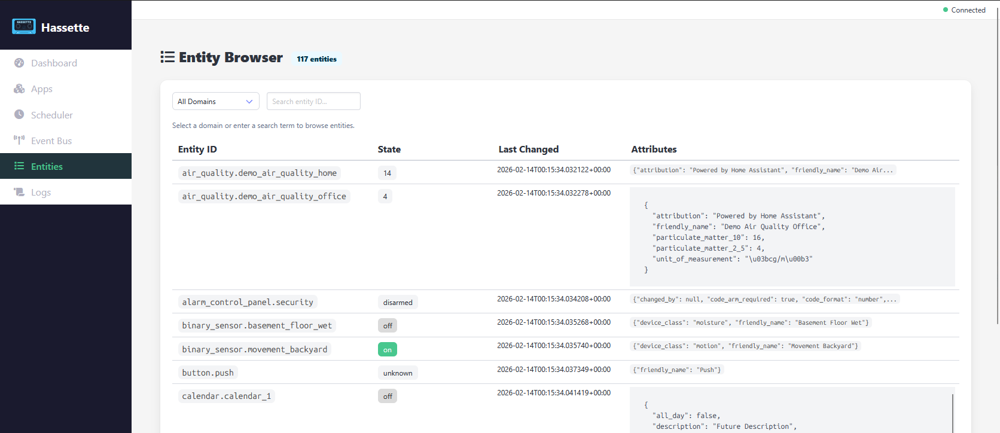

# Entities

The Entity Browser lets you inspect the current state of all Home Assistant entities tracked by Hassette.

## Entity Count

A badge next to the page title shows the total number of entities (e.g. "698 entities").

## Filtering

Two controls at the top narrow the list:

- **Domain filter** dropdown — select a specific domain (`automation`, `light`, `switch`, `sensor`, etc.) or **All Domains** to show everything.
- **Search** input — filter by entity ID. Type part of an entity name to find it quickly.

A hint below the filters reads "Select a domain or enter a search term to browse entities."

## Entity Table

| Column | Description |
|--------|-------------|
| **Entity ID** | Full entity identifier (e.g. `automation.close_garage_door`) |
| **State** | Current state shown as a colored badge — `on` (green), `off` (grey), `unavailable` (yellow) |
| **Last Changed** | ISO 8601 timestamp of the last state change |
| **Attributes** | JSON attributes from Home Assistant (e.g. `friendly_name`, `supported_features`) |

Long attribute values are truncated inline. Entities with more attributes expand to show the full JSON.

The entity list reflects live Home Assistant state and updates when state change events arrive.
