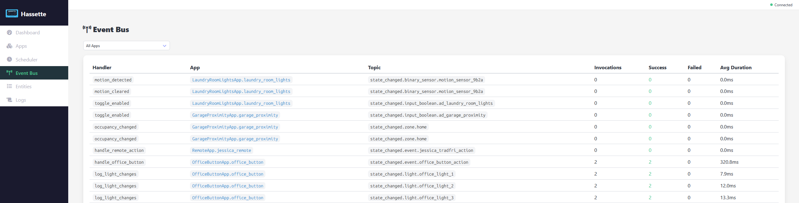

# Event Bus

The Event Bus page displays all registered event listeners and their performance metrics.

## App Filter

A dropdown at the top lets you filter listeners by app. Select **All Apps** to see everything, or pick a specific app.

## Listeners Table

Each row represents a single event listener:

| Column | Description |
|--------|-------------|
| **Handler** | Handler function name (e.g. `motion_detected`, `handle_office_button`) |
| **App** | Owning app (links to app detail) |
| **Topic** | Event topic the listener subscribes to (e.g. `state_changed.binary_sensor.motion_sensor_9b2a`) |
| **Invocations** | Total number of times the handler has been called |
| **Success** | Successful invocations (green) |
| **Failed** | Failed invocations |
| **Avg Duration** | Average handler execution time |

Metrics update in real time as events flow through the system, giving you a live view of which handlers are active and how they perform.
