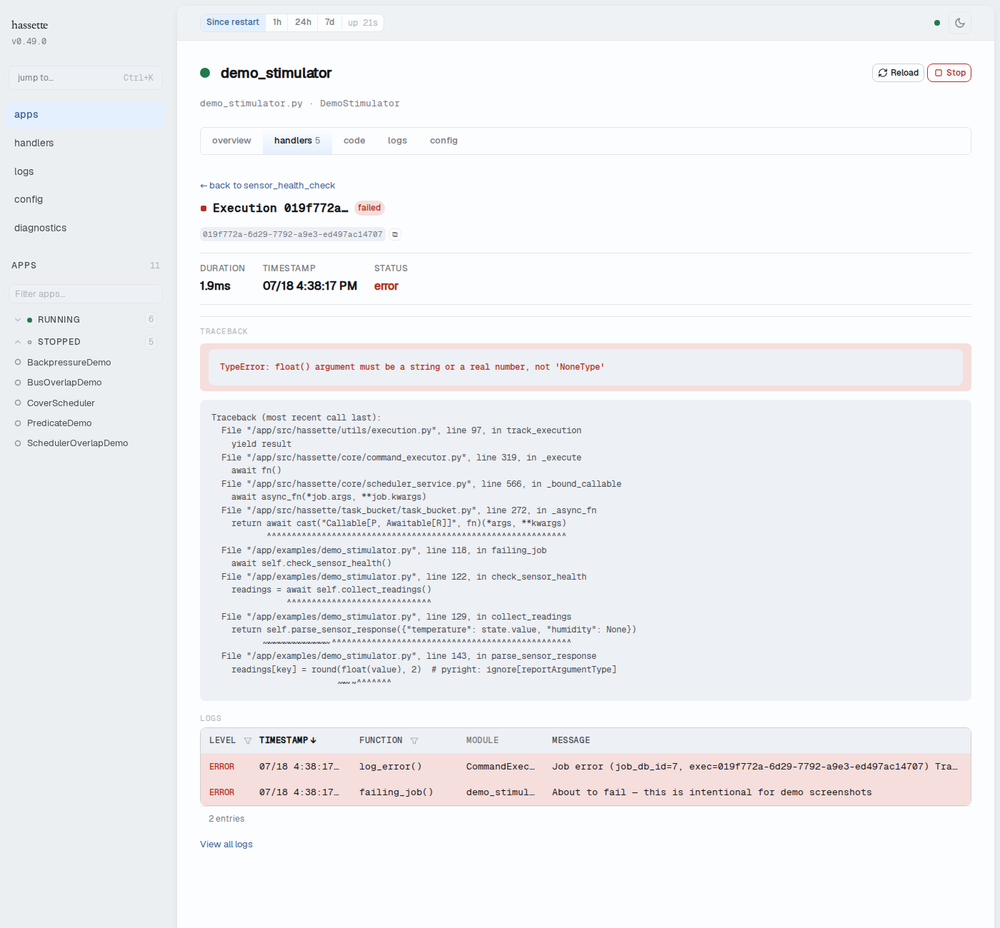

# Execution Detail

The execution detail page shows the full record of one handler invocation or job run: status, timing, trigger info, traceback, and the logs it emitted. Click any row in a handler's invocations table to open it.

## Header

A status shape and a truncated execution ID open the page. Status badges appear next to the ID for non-success outcomes: **failed**, **timed out**, **cancelled**, and **thread leaked** (the handler kept running past its timeout).

Below the header, the full execution ID appears in a monospace block with a copy button.

## Meta Stats

A stats row shows duration, timestamp, and status for the run.

## Trigger

A trigger section appears for executions that carry trigger data. It shows the trigger mode (scheduled, manual, or event-driven), a truncated context ID linking related executions, and the origin, when known.

## Error or Outcome

Failed executions show the full Python traceback in an expandable viewer. Timed-out and cancelled executions show duration and error details without a traceback, since no exception was raised. Successful executions show a single line: a green status shape and the completion time.

## Logs

An inline log table lists every entry the execution emitted, filtered to its execution ID. A **View all logs** link opens the [Logs page](logs.md) with the same filter applied, for cross-referencing against other executions or framework activity nearby.

## Navigation

A back link at the top returns to the handler or job's detail panel.

The URL follows `/apps/{appKey}/handlers/{kind}/{id}/exec/{executionId}`, where `kind` is `listener` or `job`. The URL can be shared or bookmarked directly.

## Related pages

- [Debug a Failing Handler](debug-handler.md): the invocations table that links to this page
- [Logs](logs.md): the full log view behind "View all logs"
- [Web UI overview](index.md): navigation, layout, and status bar controls
