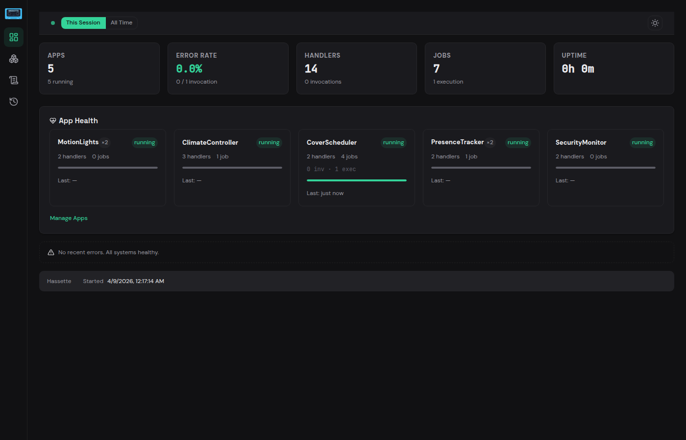

# Web UI

Hassette ships with a built-in browser dashboard for monitoring and managing your automations. No extra packages or build steps are required — it works out of the box.



## Enabling the Web UI

The web UI is **enabled by default**. It is served by the `WebApiService`, which also hosts the REST API and healthcheck endpoint.

Two settings control it:

| Setting | Default | Description |
|---------|---------|-------------|
| `run_web_api` | `true` | Enables the web API service (REST API + UI backend) |
| `run_web_ui` | `true` | Serves the browser dashboard (requires `run_web_api`) |

To disable the UI while keeping the REST API:

```toml
[hassette]
run_web_ui = false
```

See [Global Settings](../core-concepts/configuration/global.md#web-ui-settings) for the full list of configuration options.

## Accessing the UI

Once Hassette starts, open your browser to:

```
http://<host>:8126/ui/
```

The default bind address is `0.0.0.0:8126`. Change it with `web_api_host` and `web_api_port`.

## Configuration Quick Reference

| Setting | Type | Default | Description |
|---------|------|---------|-------------|
| `web_api_host` | string | `0.0.0.0` | Bind host |
| `web_api_port` | int | `8126` | Bind port |
| `web_api_cors_origins` | tuple | `("http://localhost:3000", "http://localhost:5173")` | Allowed CORS origins |
| `web_api_event_buffer_size` | int | `500` | Recent events buffer size |
| `web_api_log_buffer_size` | int | `2000` | Log entries buffer size |

## Navigation

The sidebar provides access to every section:

- **Dashboard** — system health, app summary, event bus metrics, recent events
- **Apps** — view, start, stop, and reload your automations
- **Scheduler** — scheduled jobs and execution history
- **Event Bus** — listener metrics and handler details
- **Entities** — browse Home Assistant entity states and attributes
- **Logs** — filterable, searchable log viewer with real-time streaming

## Real-Time Updates

A green **Connected** indicator in the top-right corner shows the WebSocket connection status. While connected, the UI receives live updates — new log entries stream in, event counts increment, and app statuses refresh automatically. Data also refreshes on a 30-second polling interval as a fallback.

## Tech Stack

The UI is built with [Bulma](https://bulma.io/) CSS, [HTMX](https://htmx.org/) for server-driven interactions, and [Alpine.js](https://alpinejs.dev/) for client-side reactivity. Templates are rendered server-side with Jinja2 — there is no JavaScript build step.
