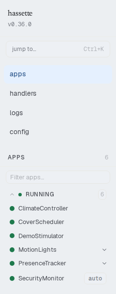
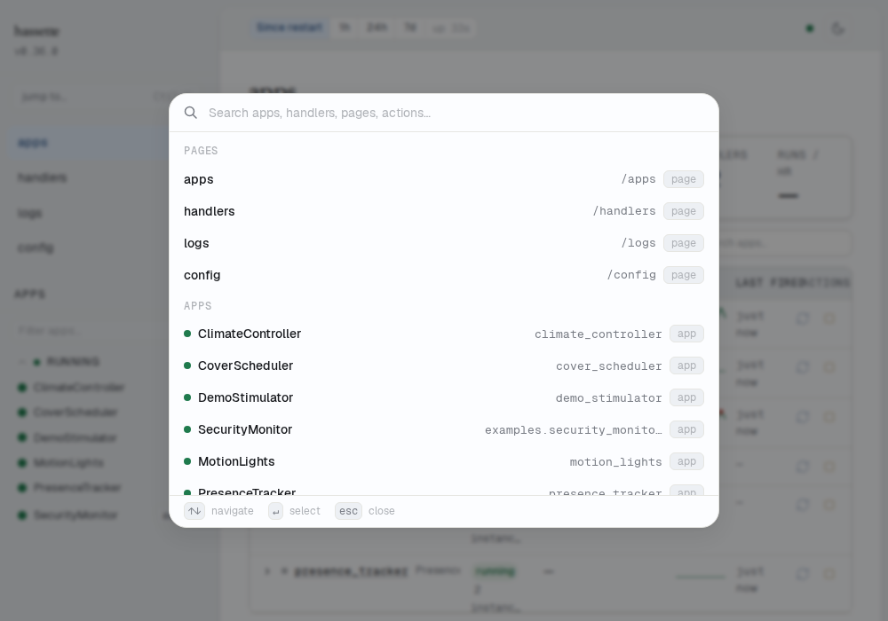

# Web UI

The web UI shows app health, handler invocation history (a handler is a function your app runs when a Home Assistant event occurs), structured logs, and system configuration.


## Enabling and Accessing

The web UI is enabled by default. Open your browser to:

```
http://<host>:8126/
```

The default bind address is `0.0.0.0:8126`. The `host` and `port` fields under `[hassette.web_api]` in `hassette.toml` control the bind address.

!!! warning "No authentication"
    The web UI has no built-in authentication. The default bind address `0.0.0.0`
    makes it reachable by anyone on the local network, including endpoints that
    start, stop, and reload automations.

    For local-only access, set `host = "127.0.0.1"` under `[hassette.web_api]`.
    For remote access, place Hassette behind a reverse proxy with authentication
    (Caddy, nginx, and Traefik all work).

The UI can be disabled independently while the REST API stays active:

```toml title="hassette.toml"
--8<-- "pages/web-ui/snippets/disable-ui.toml"
```

!!! note "First run"
    A fresh Hassette install shows empty tables and zero counts until automations
    run and handlers fire. As your apps react to Home Assistant activity, the
    tables fill in with timing data, log entries, and run history.

## Configuration

??? "Configuration quick reference"

    | Setting | Type | Default | Description |
    |---------|------|---------|-------------|
    | `[hassette.web_api] run` | bool | `true` | Enables the web API service (REST API + UI backend) |
    | `[hassette.web_api] run_ui` | bool | `true` | Serves the web UI (requires `run = true`) |
    | `[hassette.web_api] host` | string | `"0.0.0.0"` | Bind host |
    | `[hassette.web_api] port` | int | `8126` | Bind port |
    | `[hassette.web_api] cors_origins` | tuple | `("http://localhost:3000", "http://localhost:5173")` | Allowed CORS origins |
    | `[hassette.web_api] event_buffer_size` | int | `500` | How many recent events the UI keeps in memory |
    | `[hassette.web_api] log_buffer_size` | int | `2000` | How many log entries the UI keeps in memory |
    | `[hassette.web_api] job_history_size` | int | `1000` | Job execution records to keep |
    | `[hassette.web_api] ui_hot_reload` | bool | `false` | Live-reload on static file changes |

    See [Global Settings](../core-concepts/configuration/index.md) for the full reference.

## Layout

The UI has three persistent navigation elements.

The **sidebar** lists every app grouped by lifecycle status: `FAILING`, `BLOCKED`, `SLOW`, `RUNNING`, `STOPPED`, and `DISABLED`. A search field filters the list by app name. The command palette opens from the search area or with Ctrl+K (Cmd+K on macOS).



The **status bar** runs across the top. It holds a time-preset selector (Since restart, 1h, 24h, 7d) that scopes all history views. A connection indicator, uptime counter, and theme toggle sit alongside it.


The **command palette** opens with Ctrl+K or Cmd+K. It jumps to pages, apps, handlers, and actions without navigating through the sidebar.



**Alert banners** appear below the status bar when something needs attention. Red banners indicate failed apps. Amber banners mean telemetry is degraded — the database is dropping writes (queue overflow, backpressure, or an unreachable file), so some execution history may be missing. Check the database service logs for the cause.

## Pages

- **[Manage Apps](manage-apps.md)**: start, stop, and reload apps; check health and status
- **[Debug a Failing Handler](debug-handler.md)**: find why a handler is not firing or is throwing errors
- **[Read and Filter Logs](logs.md)**: search, filter, and stream logs in real time
- **[Inspect Configuration and Code](inspect-config-code.md)**: view global and per-app config, read app source
- **[Configure Health Checks](health-endpoints.md)**: choose the right endpoint for restart automation, traffic routing, or monitoring
