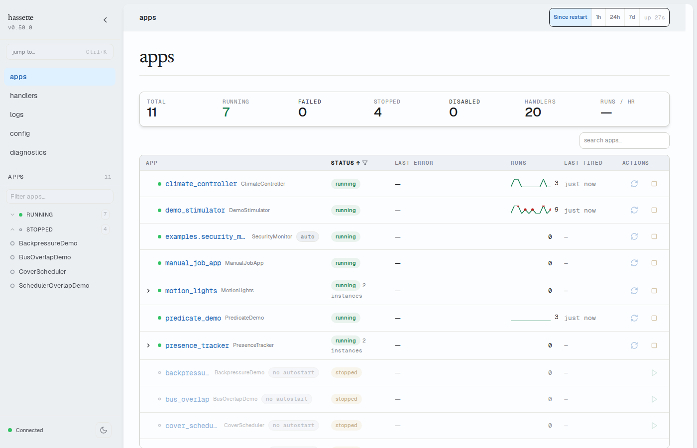
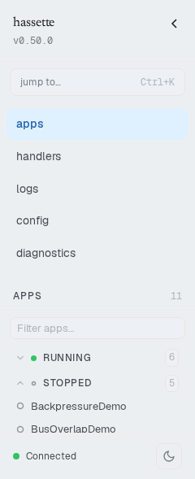
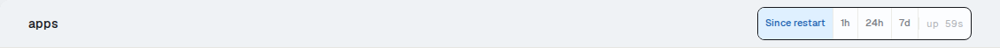
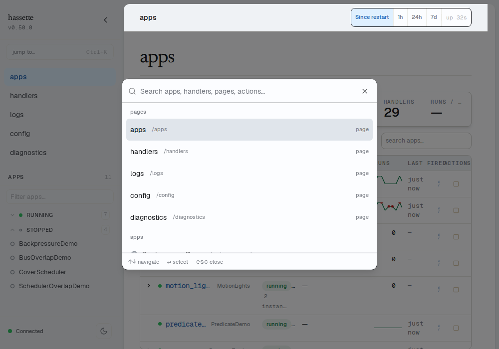

# Web UI

The web UI shows app health, handler invocation history (a handler is a function your app runs when a Home Assistant event occurs), structured logs, and system configuration.



## Enabling and Accessing

The web UI is enabled by default. Open your browser to:

```
http://<host>:8126/
```

The default bind address is `0.0.0.0:8126`. The `host` and `port` fields under `[hassette.web_api]` in `hassette.toml` control the bind address.

!!! note "Authentication is on by default"
    Hassette requires a credential for every `/api/*` route except
    `GET /api/health/live`, `GET /api/health/ready`, and
    `POST /api/auth/session`, which stay reachable without one. A peer listed
    under `trusted_proxies` is the other exception — it reaches every
    `/api/*` route without a credential, as long as it sends no
    `Authorization` header. On first start with no token configured, Hassette
    generates one, logs it once, and writes it to
    `<data_dir>/.web_api_token` (mode `0600`). Open the dashboard and paste
    that token into the login screen, or send it as
    `Authorization: Bearer <token>` from a script — see
    [CLI Configuration](../cli/configuration.md) for how the `hassette` CLI
    picks up the same token automatically.

    Setting `host = "127.0.0.1"` under `[hassette.web_api]` adds an extra layer
    for local-only access, but it isn't what stops an unauthenticated peer from
    reaching the API — the token does that regardless of bind address.

    Running a reverse proxy in front of Hassette — Caddy, Traefik, nginx, or
    the Home Assistant add-on's own ingress proxy — and listing its address
    under `trusted_proxies` relocates trust to that proxy: Hassette skips its
    own token check for requests from that peer. The Caddyfile below is a
    bare proxy hop and adds no login by itself — pair it with a forward-auth
    layer such as Authelia or tinyauth (or the add-on's own ingress auth) to
    put a login prompt at the gateway instead of Hassette's token:

    ```caddyfile title="Caddyfile"
    --8<-- "pages/web-ui/snippets/reverse-proxy-caddy.txt"
    ```

    ```toml title="hassette.toml"
    --8<-- "pages/web-ui/snippets/trusted-proxies.toml"
    ```

    `trusted_proxies` matches only the raw peer address of the request — never
    a client-suppliable header like `X-Forwarded-For` — so a bad actor on the
    same network can't spoof their way past it.

    Peer trust covers only requests that send no `Authorization` header. A
    request carrying that header is always validated against the token,
    even from a trusted peer, and a wrong or malformed header gets a 401 rather
    than falling back to the peer match. Both mechanisms therefore work on the
    same host: a browser arrives through the gateway with no `Authorization`
    header and is admitted by the peer match, while the CLI presents its bearer
    token and Hassette checks it.

    A gateway with a browser login usually rejects the `hassette` CLI's bearer
    token instead of passing it through — see [CLI Configuration: letting CLI
    traffic through a reverse proxy](../cli/configuration.md#letting-cli-traffic-through-a-reverse-proxy)
    for the additional route that lets both coexist.

The UI can be disabled independently while the REST API stays active:

```toml title="hassette.toml"
--8<-- "pages/web-ui/snippets/disable-ui.toml"
```

!!! note "First run"
    A fresh Hassette install shows empty tables and zero counts until automations
    run and handlers fire. As your apps react to Home Assistant activity, the
    tables fill in with timing data, log entries, and run history.

## Configuration

??? "Configuration quick reference"

    | Setting | Type | Default | Description |
    |---------|------|---------|-------------|
    | `[hassette.web_api] run` | bool | `true` | Enables the web API service (REST API + UI backend) |
    | `[hassette.web_api] run_ui` | bool | `true` | Serves the web UI (requires `run = true`) |
    | `[hassette.web_api] host` | string | `"0.0.0.0"` | Bind host |
    | `[hassette.web_api] port` | int | `8126` | Bind port |
    | `[hassette.web_api] auth_enabled` | bool | `true` | Requires a credential for every `/api/*` route except the two health endpoints, `POST /api/auth/session`, and requests from a `trusted_proxies` peer that send no `Authorization` header |
    | `[hassette.web_api] auth_token` | string | *(generated)* | Bearer token; generated and persisted to `<data_dir>/.web_api_token` when unset |
    | `[hassette.web_api] trusted_proxies` | tuple | `()` | IPs, CIDRs, or hostnames exempt from the token check when the request sends no `Authorization` header |
    | `[hassette.web_api] session_ttl` | int | `3600` | Seconds before an *idle* browser session cookie expires; an actively used session is renewed past the halfway mark and never interrupted |
    | `[hassette.web_api] cors_origins` | tuple | `("http://localhost:3000", "http://localhost:5173")` | Allowed CORS origins |
    | `[hassette.web_api] log_buffer_size` | int | `2000` | How many log entries the UI keeps in memory |
    | `[hassette.web_api] job_history_size` | int | `1000` | Job execution records to keep |
    | `[hassette.web_api] ui_hot_reload` | bool | `false` | Live-reload on static file changes |

    See [Global Settings](../core-concepts/configuration/index.md) for the full reference.

## Layout

The UI has three persistent navigation elements.

The **sidebar** lists every app grouped by lifecycle status: `FAILING`, `BLOCKED`, `SLOW`, `RUNNING`, `STOPPED`, and `DISABLED`. A search field filters the list by app name. The command palette opens from the search area or with Ctrl+K (Cmd+K on macOS).



The **status bar** runs across the top. It holds a time-preset selector (Since restart, 1h, 24h, 7d) that scopes all history views. A connection indicator, uptime counter, and theme toggle sit alongside it.



The **command palette** opens with Ctrl+K or Cmd+K. It jumps to pages, apps, handlers, and actions without navigating through the sidebar.



**Alert banners** appear below the status bar when something needs attention. Red banners indicate failed apps. Amber banners mean telemetry is degraded — Hassette's health check against the telemetry database failed, so the file is unreachable, locked, or unresponsive and some execution history may be missing. The banner also reports any writes dropped separately to queue overflow or retry exhaustion. The database service logs carry the cause.

## Pages

- **[Manage Apps](manage-apps.md)**: start, stop, and reload apps; check health and status
- **[Debug a Failing Handler](debug-handler.md)**: find why a handler is not firing or is throwing errors
- **[Execution Detail](execution-detail.md)**: status, traceback, and logs for a single run
- **[Read and Filter Logs](logs.md)**: search, filter, and stream logs in real time
- **[Inspect Configuration and Code](inspect-config-code.md)**: view global and per-app config, read app source
- **[Check Framework Health](diagnostics.md)**: confirm internal services are running, see boot issues and telemetry drops
- **[Configure Health Checks](health-endpoints.md)**: choose the right endpoint for restart automation, traffic routing, or monitoring
