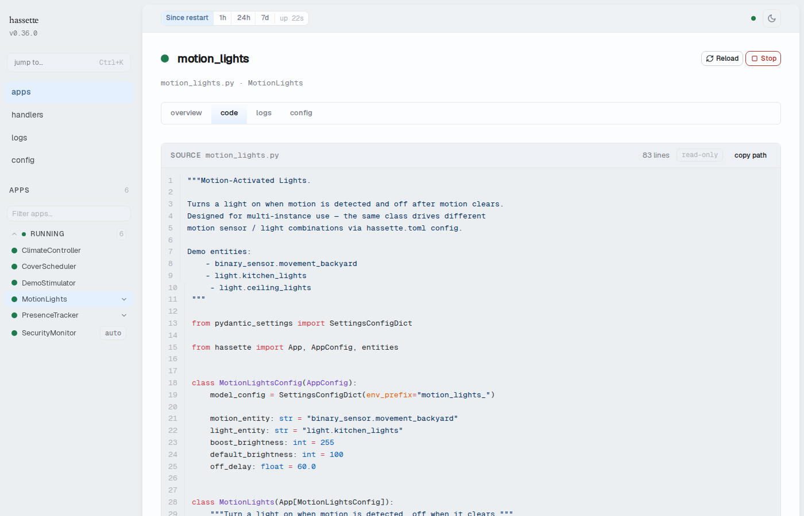

# Inspect Configuration and Code

The web UI shows what configuration Hassette is running with and what the app code looks like. No SSH access needed.

## Check Running Configuration

### Global Configuration

The Configuration page renders all `hassette.toml` values in schema-driven sections — one section per nested config group (`Web API`, `Logging`, `Lifecycle`, `Apps`, `Scheduler`, `File Watcher`, and others), plus a `general` section for top-level scalar fields. Section names and field labels come from the schema's `ui` metadata, not hardcoded strings.

Value formatting reflects the field type: booleans appear as `yes`/`no` badges, filesystem paths in monospace code style, arrays as chips, and secret fields as `🔒 ••••••••` (masked server-side before transmission). An unset optional secret shows `not set`.

The page is accessible from the sidebar under **Config**.

Values reflect the configuration loaded at the most recent startup or reload (triggered from the [Manage Apps](manage-apps.md) page or by the file watcher). Refresh the browser after a reload to see updated values.

See [Configuration](../core-concepts/configuration/index.md) for the full settings reference.

### Per-App Configuration

The **Config** tab on an app detail page shows the configuration values from `hassette.toml` for that app instance. Secret fields (`SecretStr`) are masked server-side and displayed as `🔒 ••••••••` — the plaintext never reaches the browser. When a schema is available for the app's `AppConfig`, the tab uses the shared schema renderer (same groups and formatting as the global Config page); apps without a schema fall back to a flat key-value table.

Environment variable overrides and [`AppConfig`](../core-concepts/apps/index.md) field defaults are applied when the app is instantiated, but the tab shows the raw TOML values, not the merged result. Validation still happens at startup — missing required fields and wrong types surface as startup errors rather than silent misconfiguration.

The tab is on the app detail page, accessible by selecting an app from the sidebar.

If an environment variable override is not reflected, the env var name does not match the config class field name — the expected name is the `env_prefix` from the app's `AppConfig` plus the uppercased field name (see [App Configuration](../core-concepts/apps/configuration.md)). The tab shows exactly what the app received, making it the fastest way to confirm an override took effect.

## Read App Source Code

The **Code** tab on an app detail page displays the Python source of the app as deployed. The view is read-only and syntax-highlighted.

If Hassette runs in Docker, the container's app directory may differ from your local copy. The Code tab shows what is on disk inside the running container, without needing a shell.

The tab is on the same app detail page as the Config tab.

## See Also

- [Web UI Overview](index.md): enabling, accessing, and layout
- [Configuration](../core-concepts/configuration/index.md): all available settings and how to change them
- [Apps](../core-concepts/apps/index.md): `AppConfig` fields and environment variable conventions
