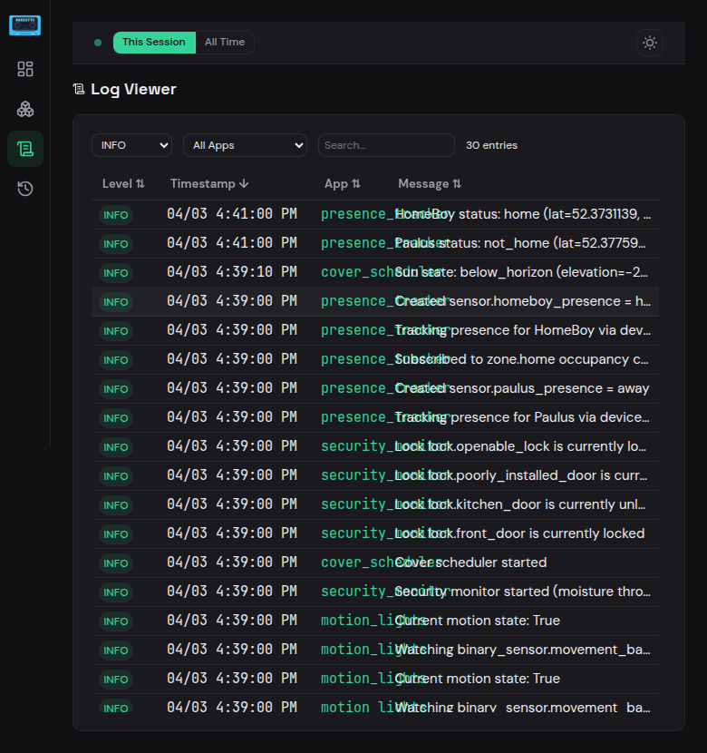

# Logs

The Log Viewer provides a filterable, searchable view of Hassette's log output with real-time streaming.

## Filters

Three controls at the top let you narrow the log entries:

- **Level filter** dropdown — `All Levels`, `DEBUG`, `INFO`, `WARNING`, `ERROR`, `CRITICAL`.
- **App filter** dropdown — `All Apps` or a specific app.
- **Search** input — free-text search across log messages.

An **entry count** indicator (e.g. "69 entries") shows how many entries match the current filters.

## Log Table

| Column | Description |
|--------|-------------|
| **Level** | Colored badge — blue for `INFO`, grey for `DEBUG`, yellow for `WARNING`, red for `ERROR`/`CRITICAL` |
| **Timestamp** | Time the log entry was recorded |
| **App** | Originating app (links to app detail), or `—` for system-level messages |
| **Message** | Log message text |

Columns are **sortable** — click a header to toggle the sort direction.

## Real-Time Streaming

New log entries arrive via WebSocket and appear at the top of the list automatically — no manual refresh needed. The entry count updates as new messages stream in.

## Buffer Size

The log viewer displays entries from an in-memory ring buffer. By default, the last **2000** entries are retained. Adjust this with the `web_api_log_buffer_size` setting in [Global Settings](../core-concepts/configuration/global.md#web-ui-settings).
