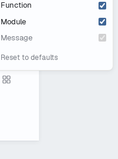
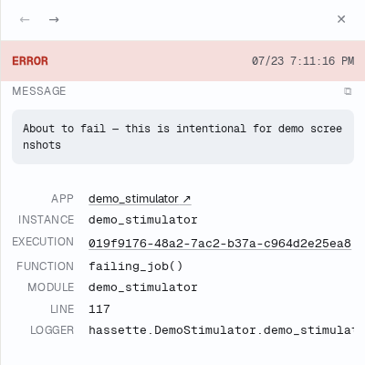

# Logs

The Logs page provides a global, filterable, searchable view of all log entries
across your hassette apps and framework internals, with real-time streaming via
WebSocket.

## Log table

The log table displays entries from all apps, sorted by timestamp descending by
default. Each row represents a single log entry.

| Column | Sortable | Filterable | Description |
|--------|----------|------------|-------------|
| **Level** | Yes | Yes (dropdown) | Severity badge: DEBUG, INFO, WARNING, ERROR, or CRITICAL |
| **Timestamp** | Yes (default, descending) | No | Time the entry was recorded |
| **App** | No | Yes (dropdown) | App key for app-generated entries, or `—` for framework logs |
| **Instance** | No | No | Instance name for multi-instance apps. To view logs from a specific instance, use the [App Detail Logs tab](app-detail/logs.md) for that instance. |
| **Execution** | No | No | Execution ID linking the entry to a specific handler invocation |
| **Function** | Yes | Yes (text input) | Name of the Python function that emitted the log entry |
| **Module** | No | No | Module and logger name |
| **Message** | Yes | No | Log message text |

Click any row to open the [log detail drawer](#log-detail-drawer) with the
complete entry metadata.

## Filtering and search

Use the column filter controls in the table header to narrow results:

- **Level** — sets the minimum level shown. Defaults to INFO. Options: All
  levels, DEBUG+, INFO+, WARNING+, ERROR+, CRITICAL only.
- **App** — filter by source. Toggle between All, Apps only, Framework only,
  then optionally select a specific app key.
- **Function** — free-text filter on the function name column.

The **search box** above the table filters by message content and logger name.

The footer shows a count of matching entries (e.g. "42 entries"). If the
filtered result exceeds 500 entries, the footer shows "showing 500 of N" — narrow
your filters to see specific entries.

## Column picker

The column picker lets you control which columns are visible.

Click the grid icon button in the table footer to open the column visibility
popover. Check or uncheck columns to toggle their visibility. **Level** and
**Message** are required columns and cannot be hidden.

Some columns are automatically hidden at narrow viewport widths. Columns hidden
by the viewport are shown as disabled in the popover with a "Hidden at this
screen size" tooltip — they cannot be toggled while the viewport is too narrow.

Click **Reset to defaults** to restore the default column set for the global
logs view (Level, Timestamp, App, Execution, Function, Module, Message).

!!! note
    The column picker is not shown on mobile viewports, where the table
    automatically uses a compact layout.

## Log detail drawer

Click any log row to open the detail drawer — a side panel showing the complete
entry.

The drawer contains:

- **Severity and timestamp** — level badge with color coding, full timestamp
- **Metadata grid** — app (link to app detail), instance, execution ID (with
  copy button), function name, module, line number, logger name
- **Message** — full message text with a copy button
- **Exception / traceback** — if the entry includes exception info, a scrollable
  code block appears with its own copy button

Use the arrow buttons in the drawer header, or press the **arrow keys** on your
keyboard, to navigate to the previous or next log entry without closing the
drawer. Press **Escape** to close.

On mobile and tablet, the drawer appears as a bottom sheet over the table. On
desktop, it opens as a side panel to the right of the table.

## Live streaming

New log entries appear in real-time as your automations run. No manual refresh
is needed.

### Auto-pause on sort

Live streaming is active only when the table is sorted by **Timestamp** (the
default). When you sort by any other column, streaming pauses so the sort order
is not disrupted by incoming entries.

When streaming is paused, a **"paused — click to resume"** button appears in
the table footer. Click it to reset the sort back to timestamp-descending and
resume live updates.

## Execution ID filtering

Append `?execution_id=<id>` to the URL to filter the log table to entries from
a single handler execution. hassette uses this URL parameter when you navigate
from the Handlers tab's execution history to the associated logs — you can also
construct the URL manually if you have an execution ID from elsewhere.

When an execution ID filter is active, the log table uses local state instead
of URL query parameters for other filters, so you can refine the results without
clobbering the execution ID in the URL.

## Related pages

- [App Detail — Logs Tab](app-detail/logs.md) — the same log table filtered to a
  single app; useful when you want to see all logs from one automation
- [App Detail — Handlers Tab](app-detail/handlers.md) — execution history for
  individual handlers, with links to filtered logs for each execution
