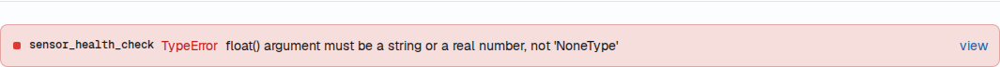
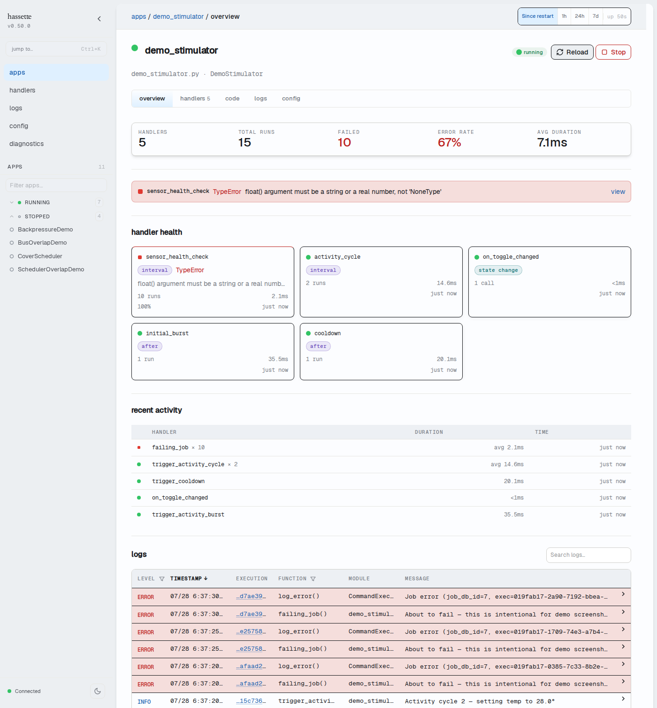
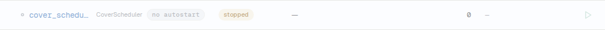
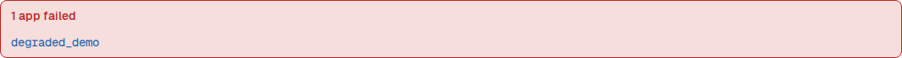

# Manage Apps

The apps dashboard shows every registered automation at a glance: health status, recent errors, and lifecycle controls, all without leaving the browser.

The apps page is the landing page of the web UI. Navigating to `/` redirects to `/apps`.

## Check App Health

The stats strip at the top shows aggregate counts: **TOTAL**, **RUNNING**, **FAILED**, **DEGRADED**, **STOPPED**, **DISABLED**, **HANDLERS**, and **RUNS/HR**. A non-zero **FAILED** or **DEGRADED** count turns that cell red or amber. Zero in both means all automations are fully healthy.

Below the strip, the app table shows one row per app with the following columns:

| Column | What it shows |
|--------|--------------|
| **APP** | Status dot, app key, and class name. An **auto** chip appears for apps discovered by directory scan rather than an explicit `hassette.toml` entry. |
| **STATUS** | Lifecycle state badge: `RUNNING`, `STOPPED`, `FAILED`, `DEGRADED`, `DISABLED`, or `BLOCKED`. |
| **LAST ERROR** | Most recent error message, truncated. Click to expand the full message. Shows `—` when the app is healthy. |
| **RUNS** | An activity sparkline showing invocation frequency over the selected time window, plus the total run count. |
| **LAST FIRED** | Relative timestamp of the most recent handler or job execution, for example "3 min ago". Shows `—` if the app has never fired. |
| **ACTIONS** | Context-sensitive buttons based on current status. See [Start, Stop, and Reload](#start-stop-and-reload) below. |

Clicking a **LAST ERROR** cell expands the full error message inline:

### Find a specific app

The search box above the table filters rows by app key and class name as you type. The status filter popover on the **STATUS** column header narrows the table to one lifecycle state. Per-status counts appear in the popover. Searching and status filtering work together.

### Drill into an app

Click any app row to open the App Detail view. The detail view shows health indicators, a handler list, recent activity, and error details across five tabs.

### Multi-instance apps

Apps with multiple instances show a parent row with a chevron and an instance count badge (e.g., "2 instances"). Click the chevron to expand into individual instance rows. Each instance row shows its own status dot, badge, last error, and action buttons. Click an instance name to open that instance's detail view.

The REST API exposes per-instance start, stop, and reload endpoints (see [Start, Stop, and Reload](#start-stop-and-reload) below) — a sibling instance keeps running untouched when one instance restarts through the API. The dashboard's action buttons still act on the whole app; a dedicated per-instance control in the UI is a separate, not-yet-built feature. A config change to just one instance in `hassette.toml` already triggers a selective reload automatically: Hassette restarts only the instance whose config changed, not the whole app. Adding or removing an instance falls back to a full app restart, since the instance list itself changed. See [Passing Configuration](../core-concepts/apps/configuration.md#multiple-instances) for the config side of this behavior.

## Start, Stop, and Reload

Action buttons appear in the **ACTIONS** column and in the App Detail header. Which buttons appear depends on the app's current status:

| Button | Available when | What it does |
|--------|---------------|-------------|
| **Start** | `STOPPED`, `FAILED`, or `DISABLED` | Initializes the app and begins processing events. |
| **Stop** | `RUNNING` or `DEGRADED` | Shuts the app down gracefully and cancels its scheduled jobs. The app stops receiving events until started again. |
| **Reload** | `RUNNING` or `DEGRADED` | Stops then starts the app, picking up code and config changes without restarting the Hassette process. |

**Stop** and **Reload** are both available for `DEGRADED` apps, not just `RUNNING` ones — a degraded app still has at least one instance running, so shutting it down or picking up new code is a meaningful recovery action. **Start** is not: nothing about `DEGRADED` implies a fully stopped app.

**Reload** picks up changes to an app's Python file or its config in `hassette.toml`. Reloading one app does not affect other running apps. A full Hassette process restart is only needed for global settings, new integrations, or Hassette updates.

These actions call the REST API — `POST /apps/{key}/start`, `/stop`, `/reload` for the whole app, or `POST /apps/{key}/instances/{index}/start`, `/stop`, `/reload` for a single instance. The CLI does not expose start/stop/reload subcommands. See [CLI Commands](../cli/commands.md) for what the CLI offers.

## Understand App States

The **STATUS** badge on each row reflects the app's current lifecycle state — one of six values.

| State | Meaning |
|-------|---------|
| `RUNNING` | The app is processing events normally. |
| `STOPPED` | The app was stopped via the UI or REST API, or it has `autostart = false` and has not been started yet. It will not process events until started. Apps with `autostart = false` show a **no autostart** chip in the APP column. |
| `FAILED` | The app encountered an unhandled error. Check the **LAST ERROR** column or the App Detail error banner for the traceback. |
| `DEGRADED` | A multi-instance app has at least one running instance and at least one failed instance. The app is partially working — check which instance failed in the [Multi-instance apps](#multi-instance-apps) view below. |
| `DISABLED` | The app has `enabled = false` in `hassette.toml`. **Start** enables it for this session. Setting `enabled = true` in config makes the change permanent. |
| `BLOCKED` | Hassette is restricted to a different set of apps via [`hassette run --app <key>`](../core-concepts/apps/index.md#restricting-which-apps-run), so this app is excluded. The block lasts for the life of the process. |

An individual *instance* row (inside a [multi-instance app](#multi-instance-apps)) carries its own, finer-grained status — including transitional states like `STARTING` that never appear on the parent app's badge.

A row for an app with `autostart = false`. The app stays `STOPPED` until started on demand, and the **no autostart** chip in the APP column marks why.

A `DEGRADED` app also appears in the [failed apps alert banner](index.md#layout) alongside apps that are fully `FAILED` — a partially working app still needs attention.

For the full lifecycle state machine and transition rules, see [Apps lifecycle](../core-concepts/apps/lifecycle.md).
