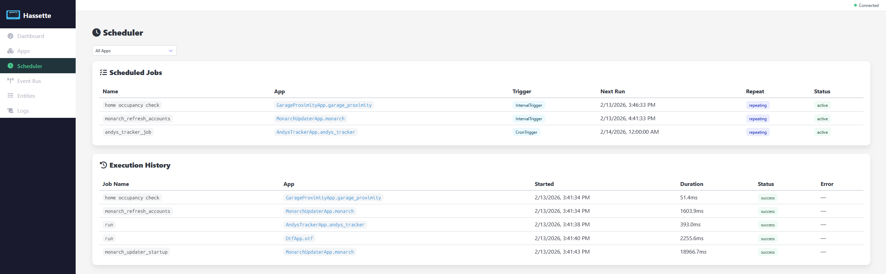

# Scheduler

The Scheduler page shows all scheduled jobs and their execution history.

## App Filter

A dropdown at the top lets you filter by app. Select **All Apps** to see everything, or pick a specific app to scope both tables.

## Scheduled Jobs

The top table lists all active jobs:

| Column | Description |
|--------|-------------|
| **Name** | Job name (e.g. `home_occupancy_check`) |
| **App** | Owning app (links to app detail) |
| **Trigger** | Trigger type — `IntervalTrigger` or `CronTrigger` |
| **Next Run** | When the job will next execute |
| **Repeat** | Whether the job repeats (`repeating` badge) or runs once |
| **Status** | `active` or `paused` |

## Execution History

The bottom table records past job runs:

| Column | Description |
|--------|-------------|
| **Job Name** | Name of the executed job |
| **App** | Owning app (links to app detail) |
| **Started** | When the execution began |
| **Duration** | How long the execution took (e.g. `51.4ms`) |
| **Status** | Result badge — `success`, `error`, or `timeout` |
| **Error** | Error message if the job failed, otherwise `—` |

This makes it easy to spot slow or failing jobs and correlate them with specific apps.
