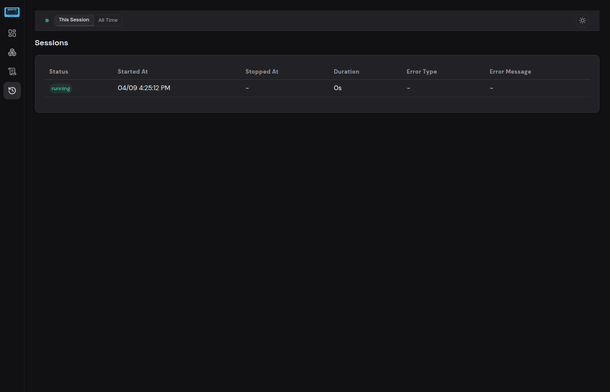

# Sessions

The Sessions page shows a history of every time Hassette has started and stopped. Each row represents one Hassette process lifetime — from startup to shutdown (or crash).

## What Is a Session?

A **session** begins every time Hassette starts and ends when it shuts down. If you restart Hassette, the previous session is finalized and a new one is created. Sessions that were still marked as "running" when Hassette starts (e.g. after a power loss or `kill -9`) are automatically marked as **unknown**.

This gives you a clear timeline of your Hassette uptime — when it was running, how long each run lasted, and whether it exited cleanly or crashed.

## Session Table

The table displays one row per session, ordered newest first:

| Column | Description |
|--------|-------------|
| **Status** | Colored badge: **running** (current session), **success** (clean shutdown), **failure** (crashed), or **unknown** (orphaned) |
| **Started At** | Timestamp when Hassette started |
| **Stopped At** | Timestamp when Hassette shut down, or `—` if still running |
| **Duration** | How long the session lasted (e.g. `2h 15m`) |
| **Error Type** | Exception class name if the session ended in a crash, otherwise `—` |
| **Error Message** | Error details if the session crashed, otherwise `—` |

## Session Scope Toggle

The status bar at the bottom of every page includes a **This Session / All Time** toggle. This controls the time range for telemetry data displayed on the Dashboard and App Detail pages:

- **This Session** — shows handler invocations, job executions, error rates, and KPIs for the current Hassette run only.
- **All Time** — shows aggregated data across all sessions in the retention window.

Your selection is saved in the browser's localStorage and persists across page reloads.

## Status Badges

| Badge | Meaning |
|-------|---------|
| **running** | Hassette is currently running (the active session) |
| **success** | Hassette shut down cleanly |
| **failure** | A service crashed during this session — check the Error Type and Error Message columns for details |
| **unknown** | The session was still "running" when Hassette next started, indicating an unclean exit (power loss, `kill -9`, OOM kill, etc.) |
